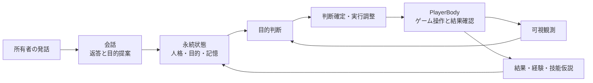

# mc-bot-egent-practice-2

Minecraft Java Editionの世界に一人のプレイヤーとして暮らし、指定利用者（owner）と日本語で会話しながら、自分の目的と観測した状況から行動するAIコンパニオンです。

目指すのは、人格・関係・共有経験・記憶が継続する存在です。現在の実装は、人格設定、構造化記憶、会話エージェント、目的エージェント、ゲーム操作を担うPlayerBodyを組み合わせています。人間らしさや長期自律性の達成を一括して保証するものではありません。

## 技術文書の読み方

| 知りたいこと                                       | 読む文書                                                       |
| -------------------------------------------------- | -------------------------------------------------------------- |
| 全体がどうつながるか、どのコードを読むか           | [アーキテクチャ](docs/architecture.md)                         |
| 発話から目的・行動へどう進むか、停止・競合・再接続 | [自律プレイヤー](docs/autonomous-player.md)                    |
| 人格や関係が入力へどう入り、何が再起動後も残るか   | [人格と記憶](docs/memory.md)                                   |
| 見える世界、使える操作、成功/未確認の判定          | [PlayerBody](docs/player-body.md)                              |
| 経験が技能仮説になり、次回の判断へ戻る仕組み       | [MC Bot Skills](docs/mc-bot-skills.md)                         |
| 何を証拠に評価し、どこから原因を調べるか           | [テスト・評価と原因調査](docs/testing.md)                      |
| 起動、停止、バックアップ、障害対応                 | [運用](docs/operations.md)                                     |
| 画面・traceの見方                                  | [観測ダッシュボード](docs/dashboard.md)                        |
| 現行AIプレイヤーの実ゲーム評価条件・過去結果       | [AIプレイヤーE2E](docs/ai-player-e2e.md)                       |
| 旧方式の仕様を保守する                             | [legacy runtime](docs/architecture.md#旧toolruntime経路の詳細) |

文書体系と配置判断は[文書構成](docs/documentation-structure.md)、開発作業のルールは[AGENTS.md](AGENTS.md)を参照してください。

## 既定の動作と境界



- 既定起動は `createApplication() → createPlayerApplication()`。チャットがなくても、起動・結果・意味のある変化・待機期限などで目的を再判断します。
- 会話は身体を直接操作せず、目的提案を保存します。実行中でも会話でき、行動変更は別の判断で確定します。
- 所有者の停止は永続化し、再開するまで維持します。危険や建築変更は状況に応じた判断対象ですが、停止、サーバー権限、外部アクセス境界を越えません。
- 操作受付やモデルの発言だけではゲーム内成功にしません。観測が不足すれば `unverified` として扱います。
- shell、任意コード、server管理用操作をモデルに公開しません。旧方式の固定reflexや作業skillは[legacy経路](docs/architecture.md#旧toolruntime経路の詳細)で区別します。

## 必要環境と起動

- Node.js 24を推奨。packageの最低要求は22.13.0です。
- npm、書込み可能なSQLite保存先。
- 通常プレイには対応するMinecraft Java Editionサーバー、許可されたbot/ownerの識別情報、OpenAI APIの利用資格・到達性が必要です。

```bash
npm ci
cp .env.example .env.local
# .env.local に、その環境で許可された設定値を入力
npm run build
npm run dev
```

[設定例](.env.example)と[設定schema](src/config/schema.ts)が設定名・必須性・既定値の正本です。API keyや接続情報の不足・不正は、接続前の設定エラーとして扱います。実値、会話、実記憶、world情報をGitHubへ掲載しないでください。

| 設定                                                       | 用途・既定値                             |
| ---------------------------------------------------------- | ---------------------------------------- |
| `MINECRAFT_HOST` / `MINECRAFT_USERNAME` / `OWNER_USERNAME` | 必須。botとownerは別のMinecraft identity |
| `MINECRAFT_PORT` / `MINECRAFT_AUTH` / `MINECRAFT_VERSION`  | `25565` / `microsoft` / `1.21.11`        |
| `OPENAI_API_KEY` / `OPENAI_MODEL`                          | key必須 / model既定 `gpt-6-luna`         |
| `DATABASE_PATH`                                            | `data/companion.sqlite`                  |
| `PERSONA_PATH`                                             | `config/persona.example.json`            |
| `DASHBOARD_ENABLED` / `DASHBOARD_PORT`                     | `true` / `4310`                          |

Botの接続版と、利用者が使うMinecraftクライアント版は同一とは限りません。[26.1クライアントとの接続手順](docs/minecraft-26-1.md)を参照してください。起動前には[ゲームモード・難易度・権限](docs/operations.md#起動前の確認)を確認します。

## 会話と停止

所有者はゲーム内チャットで依頼・相談します。一般の発話はモデルが文脈から判断し、行動依頼なら目的提案へ進みます。複数工程の依頼が必ず達成されるという意味ではありません。

```text
近くの木を集めたい。一緒に進めよう。
いま何をしようとしている？
次回も覚えておいて。探索の前に持ち物を確認したい。
停止
```

`停止`、`停止して`、`止まって`、`止めて`、`ストップ`、`やめて`、`中止`、`中断`の完全一致はLLMを待たず処理します。停止後の再開は所有者の新しい明確な指示を会話エージェントが判断します。保存される記憶の種類と限界は[人格と記憶](docs/memory.md)にあります。

## ダッシュボード

起動後は既定の [http://127.0.0.1:4310](http://127.0.0.1:4310) で、読み取り専用のtrace・Live・Replay画面を確認できます。画面からbotや記憶を操作しません。非loopback公開は認証とネットワーク保護を伴う別の運用判断です。[画面の構成](docs/dashboard.md)と[原因調査](docs/testing.md)を参照してください。

## 検証と現在の限界

型・単体・結合テスト、画面テスト、実Minecraft/APIによる評価は別の証拠です。過去の限定された場面での成功を、最新HEAD・別world・長期連続プレイの保証に広げません。文書刷新では動作テストを追加実施していません。

- 通常の品質確認と変更pathごとのCI: [testing.md](docs/testing.md)
- 実ゲーム評価の選択・予算・未完了判定: [ai-player-e2e.md](docs/ai-player-e2e.md)
- 初期コンパニオンの2026-08-25評価は旧経路の歴史的記録: [実施結果](docs/testing.md#2026-08-25-実施結果)

複数bot、複数LLM provider、音声会話、クラウド常駐の運用保証、Minecraftサーバー管理は現在の提供範囲に含めません。
