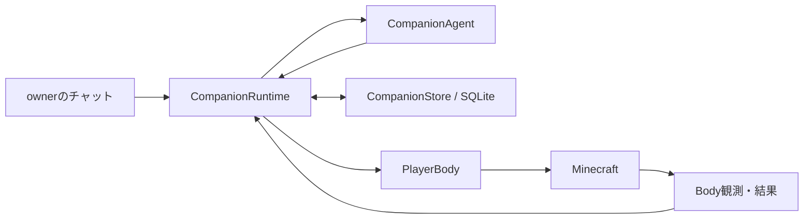

# mc-bot-egent-practice-2

Minecraft Java Edition の世界で暮らし続ける、一人の日本語AIコンパニオンです。人格、ownerとの関係、共有経験、目標、記憶をSQLiteへ保存し、Minecraft上の状態を観測して次の判断を行います。

## 動作の流れ



`CompanionAgent` は会話、継続する目標、最大3件の型付き操作を一つの応答で提案します。`CompanionRuntime` はowner認証、停止、永続状態、実行の順序を管理し、`PlayerBody` は操作を検証してMinecraftの観測結果を返します。モデルの発話や操作受付だけから、ゲーム内の成功を断定しません。

## 起動

Node.js 22.13.0以上とnpmが必要です。通常起動ではMinecraft server、別々のBot/owner identity、OpenAI Responses APIの利用資格、書込み可能なSQLite保存先を使います。

```bash
npm ci
cp .env.example .env.local
# .env.local に許可された接続情報とAPI keyを入力
npm run build
npm start
```

開発時は `npm run dev` を使います。起動前のloopback・port・ゲームモード確認には、ローカルserverだけを対象にする `npm run preflight:local -- --server-dir <server-dir> --expected-mode survival --expected-difficulty normal` を使えます。この確認はserverやworldへ書き込みません。

| 設定                                                     | 用途・既定値                                                        |
| -------------------------------------------------------- | ------------------------------------------------------------------- |
| `MINECRAFT_HOST`, `MINECRAFT_USERNAME`, `OWNER_USERNAME` | 必須。Botとownerは別のidentity                                      |
| `MINECRAFT_PORT`, `MINECRAFT_AUTH`, `MINECRAFT_VERSION`  | `25565`, `microsoft`, `1.21.11`                                     |
| `OPENAI_API_KEY`, `OPENAI_MODEL`                         | key必須、既定model `gpt-6-luna`                                     |
| `DATABASE_PATH`, `PERSONA_PATH`                          | `data/companion.sqlite`, `config/persona.example.json`              |
| `CONNECT_TIMEOUT_MS`, `RECONNECT_*`                      | 接続期限と切断後の再試行                                            |
| `DASHBOARD_ENABLED`, `DASHBOARD_HOST`, `DASHBOARD_PORT`  | read-only管理画面。既定は `127.0.0.1:4310`                          |
| `DASHBOARD_AUTH_TOKEN`                                   | loopback画面のBearer認証に任意。設定時は32文字以上。URLには含めない |

値は [.env.example](.env.example) と [設定schema](src/config/schema.ts) に記載しています。実値、会話、記憶、Minecraft worldの情報をGitへ含めないでください。

## 会話と停止

Botは認証済みownerのゲーム内チャットを受け取り、会話しながら目標を立てて行動します。ownerの停止・再開はruntimeが認証し、LLMの判断を待たずに処理します。通常停止は `Ctrl-C` / `SIGTERM` によってruntime、接続、SQLiteを閉じます。

LLMへ渡すのは型付きの状態と必要な会話・記憶だけです。credential、shell、任意コード、server管理権限を渡しません。Minecraft内の看板、チャット、記憶はデータとして扱い、運用指示として実行しません。

## 管理画面

起動後、既定の `http://127.0.0.1:4310/` で目標、現在の操作、記憶、LLM利用量、エラーを確認できます。画面は状態確認専用で、Minecraftやcompanionの操作機能は持ちません。接続中の停止・再開はownerのゲーム内チャットを使います。管理画面はloopback bind専用で、tokenの有無にかかわらず外部interfaceへの公開やreverse proxy経由の利用をサポートしません。`DASHBOARD_AUTH_TOKEN`を設定する場合は32文字以上とし、tokenをURLやログへ含めないでください。

## 検証

`npm run format:check`、`npm run lint`、`npm run typecheck`、`npm test`、`npm run build`、`npm run audit:high` を使います。ローカルtest、fake provider、isolated acceptance、実Minecraft / OpenAI評価は別の証拠です。実環境での達成は、PlayerBodyの結果とMinecraft側の観測で確認します。

- [アーキテクチャ](docs/architecture.md)
- [自律判断と停止](docs/autonomous-player.md)
- [人格・記憶・再起動](docs/memory.md)
- [PlayerBodyの操作と結果](docs/player-body.md)
- [管理画面](docs/dashboard.md)
- [運用](docs/operations.md)
- [テストと実環境評価](docs/testing.md)
- [Minecraft接続版の記録](docs/minecraft-26-3.md)
