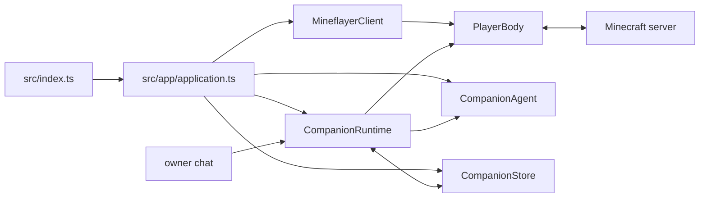

# アーキテクチャ

製品の実行経路は一つです。`src/index.ts` が設定を検証し、`createApplication()` がMinecraft接続、`PlayerBody`、`CompanionAgent`、`CompanionStore`、`CompanionRuntime` を組み立てます。

## 責務

- **Application** は設定済みの依存を作り、接続、チャット受付、起動失敗時の後始末、通常終了をまとめます。
- **CompanionRuntime** は認証済みownerの入力、停止状態、現在の目標・計画、Body操作の実行、結果保存、次の判断を調整します。Body操作を同時に競合させません。
- **CompanionAgent** はpersonaと有限の会話履歴、記憶、現在のPlayerBody観測を使い、構造化された一件の判断を返します。操作はPlayerBodyのschemaで検証されます。
- **CompanionStore** は停止状態、目標・計画、操作状況、記憶、上限付きの会話・結果履歴をSQLiteに保存します。
- **PlayerBody** はMinecraftの観測と操作を実装し、受付・依頼ではなく観測された実結果を返します。

## 重要な境界

- `OWNER_USERNAME` が一致するプレイヤーだけが停止・再開や会話上の権限を持ちます。Minecraft Botとownerは同じidentityにできません。
- ownerの永続停止はモデルへ委譲せず、storeへ保存します。
- World内の文章、チャット、記憶は非信頼データです。credential、shell、server管理操作はAgent入力にも操作schemaにもありません。
- 操作の成功はPlayerBodyの結果と必要な後続観測で判定します。LLMの発話やモデル応答を達成の根拠にしません。
- 接続失敗は有界のretry/timeoutで処理し、終了時はRuntime、Minecraft接続、SQLiteの順に閉じます。
- read-only管理画面はruntime/storeの現在状態と安全な集計だけを表示します。ゲーム操作、trace、replayは提供しません。

## 構成と依存

TypeScript strict、Node.js、Mineflayer、OpenAI Responses API、SQLiteを一つのNode.jsプロセスで使います。小さなHTTP管理画面を同じプロセスで配信し、React/Three.js、trace保管、旧tool/skill/reflex runtimeは使いません。

SQLiteの移行・保全は [人格と記憶](memory.md) と [運用](operations.md) を参照してください。画面の項目は[管理画面](dashboard.md)、Body操作や実結果の定義は [PlayerBody](player-body.md) が正本です。
