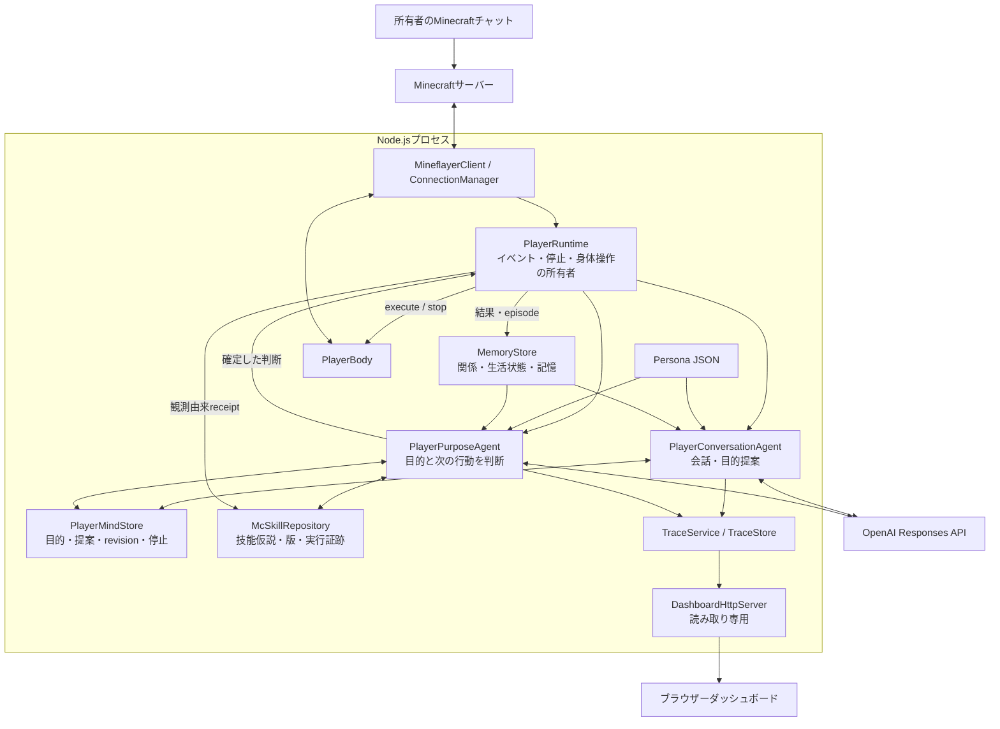

# アーキテクチャ

この文書は **既定の自律AIプレイヤー** の全体構成を説明します。読み進める順序は [README](../README.md#技術文書の読み方) を参照してください。

## 調査基準と読み方

Issue #121 の文書刷新は、2026-10-03 時点の `10e1bdece5a6784856d96fd584100698d3d804f2` を基準に dot が単独でコードを調査して行いました。実装の変更・動作テストは実施していません。以下の図はコードの責務・呼出し関係を表し、実ゲームでの達成保証ではありません。以後のコード変更では対応する文書も更新してください。

- **設計意図**: Minecraftで継続する一人の存在として、人格、関係、共有経験、自分の目的を行動に反映する。
- **実装**: 設定・構造化記憶・観測を大規模言語モデル（LLM）へ渡し、型付きの判断を永続状態へ確定した後、身体操作を実行する。
- **評価**: 発話の自然さ、目的の達成、停止の維持、技能の再利用などを別々に調べる。実装があることと、ある場面で動いたこと、長期に安定することを区別する。

「人格」「思考」「学習」は本システムの設計上の呼称です。内面的な意識や、人間と同等の一般能力を実証したという意味ではありません。

## 起動点とプロセス境界

[入口](../src/index.ts) は設定を検証し、[createApplication](../src/app/application.ts) から [createPlayerApplication](../src/app/player-application.ts) を作ります。Node.js / TypeScript の一つのサーバープロセス内に、会話、目的判断、身体制御、SQLite、観測用HTTPサーバーを組み立てます。ブラウザー側のダッシュボードは別の表示クライアントです。



図の矢印は主要な関係を抽出したものです。たとえば会話の目的提案はMindStoreへ保存し、コールバックでRuntimeを起こします。会話からBodyへ直接操作を送る経路はありません。

## 責務と実コード

| 領域           | 主な責務                                                  | 入口・正本                                                                                     |
| -------------- | --------------------------------------------------------- | ---------------------------------------------------------------------------------------------- |
| 組立・終了     | 設定、DB、APIクライアント、接続、購読、終了順序           | [player-application.ts](../src/app/player-application.ts)                                      |
| 会話           | 所有者の発話、短期会話文脈、目的提案、停止/再開、記憶依頼 | [agents.ts / PlayerConversationAgent](../src/player/agents.ts)                                 |
| 目的判断       | 観測・目的・記憶・技能を踏まえた行動/待機/継続/完了の選択 | [agents.ts / PlayerPurposeAgent](../src/player/agents.ts)                                      |
| モデル呼出し   | strict schema、tool loop、使用量、打切り、context圧縮     | [responses.ts](../src/player/responses.ts)                                                     |
| 実行調整       | 意味のある変化で起動、一つのBody操作、割込み、再接続      | [runtime.ts](../src/player/runtime.ts)                                                         |
| 意思決定状態   | revision比較、提案とgoalの関連、結果・停止の永続化        | [mind-store.ts](../src/player/mind-store.ts)                                                   |
| 身体           | 可視観測、操作schema、Mineflayer操作、結果確認            | [player-body.ts](../src/minecraft/player-body.ts)、[詳細](player-body.md)                      |
| 人格・長期記憶 | 人格設定、関係、生活状態、既往episodeの保存と検索         | [persona.ts](../src/persona/persona.ts)、[store.ts](../src/memory/store.ts)、[詳細](memory.md) |
| 技能知識       | 検索、版管理、観測証跡による仮説作成・改訂                | [repository.ts](../src/mc-skills/repository.ts)、[詳細](mc-bot-skills.md)                      |
| 観測性         | 内容を絞ったtrace、集計、読み取り専用画面                 | [trace/service.ts](../src/trace/service.ts)、[dashboard](dashboard.md)                         |

## なぜ会話と行動を分けるのか

長い移動や採掘が続いていても会話を受け取れるように、会話と目的判断は別の呼出しにしています。一方、二者が同時に身体を動かすと競合するため、`PlayerBody.execute()` の所有者は `PlayerRuntime` に集約します。

共有状態の競合には Compare-And-Swap（CAS、読んだ版と現在の版が一致する時だけ更新する方式）を使います。`revision` は判断の前提、`actionRevision` は身体操作の有効性、`stopGeneration` は停止/再開の世代を守ります。これは「モデルが古い回答を返さない」という期待に依存しない仕組みです。詳細と時系列は[自律プレイヤー](autonomous-player.md)にあります。

## 設計上の判断と強制される境界

| 対象                                      | 誰が決めるか                                   | 注意点                                                 |
| ----------------------------------------- | ---------------------------------------------- | ------------------------------------------------------ |
| 何をしたいか、所有者の提案をどう扱うか    | 目的エージェントが人格・目的・観測を材料に判断 | 採用・妥協・辞退の理由とowner goalを保持               |
| 危険、死亡、建築変更への対応              | 目的エージェントが状況から判断                 | 旧reflexの固定退避・旧建築認可を既定経路へ持ち込まない |
| 入力の形・同時操作・停止状態              | schema、MindStore、Runtime、Body               | 型検証やCASは、目的の妥当性まで保証するものではない    |
| ゲーム内の操作可否                        | 通常のMinecraft/Bukkit権限と保護plugin         | client側の操作受付だけで成功にしない                   |
| credential、shell、任意コード、server管理 | モデルへ操作手段を公開しない                   | 既存サーバー設定の変更は別の運用作業                   |
| 何を達成したか                            | 操作後のゲーム観測と、その後の目的判断         | `successful`な一操作とowner goal完了は別               |

## データの流れ

1. 人格JSONと保存済み記憶を読み、現在の観測とMindStoreのsnapshotを揃える。
2. 会話は提案を保存する。目的判断は必要な知識や技能を読み、状態更新と判断をCASで確定する。
3. RuntimeはBodyを実行し、実行前後の観測に基づく結果を受け取る。
4. 結果を技能receipt、episode、MindStoreへ順に記録し、次の判断を起こす。
5. 成功したreceiptがあれば、再利用可能な方法かを学習評価し、技能仮説を作成/改訂する場合がある。

複数storeへの結果記録全体は一つのtransactionではありません。たとえばgoal mirrorの保存失敗はMindStoreの確定を取り消さず、別の失敗として扱います。復旧と保持期間は[人格と記憶](memory.md)、追跡方法は[テスト・評価](testing.md)を参照してください。

## 既定経路とlegacyを混同しない

`createLegacyApplication()` は旧 `ChatCoordinator → OpenAIDeliberationAgent → ToolExecutor → TaskRuntime → skills` を明示的に組み立てる互換・比較用経路です。既定の起動ではこれらの制御主体や `ReflexCoordinator` は起動しません。

- `src/mc-skills/`: 既定プレイヤーが読む**技能知識**。モデルが選び、観測に基づき改訂する。
- `src/skills/`: 旧経路の**決定論的な作業実装**。同じ「skill」という語でも役割が違う。
- `src/runtime/`: 接続等に再利用される小さな共通処理もある。ディレクトリ全体が未使用という意味ではない。
- TreeGuardの旧採掘制限はlegacy設定を有効化した場合の補助。既定Bodyの必須条件ではない。

旧経路の責務・制限・再起動契約は[legacy runtime](architecture.md#旧toolruntime経路の詳細)へ分離しています。旧経路の2026-08-25実測結果を、現行プレイヤーの全機能検証へ読み替えないでください。

## 技術選定と変更時の入口

- Node.js / TypeScriptで判断と身体の契約を共通化し、MineflayerでJava Editionへ接続する。
- OpenAIのTypeScript SDKからResponses APIを使用する。model名の既定値は[設定schema](../src/config/schema.ts)を参照する。
- 永続化はSQLite。MindStore、MemoryStore、Skill、Traceは同一DBファイル内の別の責務を持つ。
- 依存versionは [package.json](../package.json) とlockfileを正本にする。既定接続版と26.1クライアントの区別は[接続手順](minecraft-26-1.md)にある。

会話品質なら `PlayerConversationAgent`、行動選択なら `PlayerPurposeAgent`、割込みなら `PlayerRuntime`、結果の真偽なら `PlayerBody`、継続性ならMindStoreとMemoryStore、技能の変化ならMcSkillRepositoryの順に調査対象を絞ります。実行記録を根拠に絞る方法は[評価と原因調査](testing.md)を参照してください。

## 旧tool/runtime経路の詳細

以下は `createLegacyApplication()` 専用の仕様です。既定経路の制限や成功証拠へ読み替えません。

<details>
<summary>旧経路を保守する場合に開く</summary>

## 境界

アプリケーションは Node.js / TypeScript strict の単一プロセスです。Minecraft 操作は Mineflayer、永続化は SQLite、会話と tool calling は OpenAI Responses API を使います。Python process、独自 WebSocket bridge、別言語の重複した command 定義は導入しません。

### 技術選定

一次情報とpackage metadataを確認し、次を固定しています。

- Node.jsは24 LTSを推奨し、依存packageが対応する22 / 24をCI matrixにする。[Node.js Releases](https://nodejs.org/en/about/previous-releases)
- 本リポジトリで固定するMineflayer 4.37.1はMinecraft 1.21.11対応をreleaseで明記しているため、既定のBot接続先を1.21.11にする。[PrismarineJS/mineflayer 4.37.1](https://github.com/PrismarineJS/mineflayer/releases/tag/4.37.1) 26.1クライアントを使う検証では、[サーバー側の互換構成](minecraft-26-1.md)を別に指定する。Botの`MINECRAFT_VERSION`をクライアント版に合わせて変更しない。
- LLMは公式`openai` TypeScript SDKのResponses APIとstrict function callingを使い、既定modelは`gpt-6-luna`とする。[OpenAI Responses API](https://developers.openai.com/api/reference/typescript/resources/beta/subresources/responses/methods/create)、[gpt-6-luna](https://developers.openai.com/api/docs/models/gpt-6-luna)
- 永続化は埋め込み型SQLiteとFTS5を使う。初期版でnetwork database、vector database、provider抽象化を追加しない。

依存versionは`package.json`と`package-lock.json`へ完全固定します。Mineflayerの認証推移から入るmoderate advisoryは実装成功と分けて追跡し、脆弱な旧Mineflayerへのdowngradeを自動修正として採用しません。

次の図と後続の責務表はlegacy helperの構造です。既定PlayerBodyのruntime図ではありません。

```text
authorized chat / task event
            |
            v
agent -> persona + memory context -> OpenAI Responses API
  |                                      |
  |                         typed function call only
  v                                      v
tools -> runtime -> skills -> minecraft adapter -> Minecraft server
  |         |           |             |
  |         |           +-> verification snapshots
  |         +-> cancellation / timeout / priority
  +-> schema validation / user-facing result

Minecraft observations -> reflexes -> runtime cancellation or safety action
all execution boundaries -> observability (correlation ID, redacted logs)
```

依存は高水準の会話・tool から低水準の runtime・Minecraft adapter へ向けます。`memory` と `persona` は agent が読む状態であり、Minecraft adapter に依存しません。`verification` は action 前後の snapshot を比較して結果を返し、LLM の自己申告を成功根拠にしません。

旧Bot helperの体力・空腹・酸素・水中状態は、`observedAt`、`subject: "bot"`、`source: "minecraft"` を持つ同一の観測として扱います。`observe_status` と `observe_surroundings` は `requesterVitals: "unobserved"` を返し、利用者の体調をBotの値から推測しません。酸素の低下は同じ観測の `inWater` と `oxygenState` を使って判定し、範囲外または取得できない値は `unknown` として発話や低酸素の断定に使いません。旧reflex helperが介入した場合は、開始観測、終了観測、介入結果、失敗分類を記録します。

#### Legacy helperの責務

| 領域            | 責務                                                                 | 境界                                                                       |
| --------------- | -------------------------------------------------------------------- | -------------------------------------------------------------------------- |
| `minecraft`     | Mineflayer 接続、観測、移動、採掘、inventory、切断イベント           | 実際の server state だけを観測結果として返す                               |
| `runtime`       | 一つの主作業、状態遷移、優先順位、cancel、retry、timeout、checkpoint | `queued / running / suspended / completed / failed / cancelled` を区別する |
| `reflexes`      | 停止、空腹、危険、被ダメージ、stuck、切断への即時対応                | LLM を呼ばない                                                             |
| `tools`         | LLM に公開する高水準操作と input validation                          | schema 不正な引数を実行しない                                              |
| `skills`        | 複数操作を含む決定論的な実行単位                                     | precondition、cancel、timeout、retry、snapshot、success / failure を持つ   |
| `agent`         | 日本語会話、tool calling、検証済み結果の説明                         | 自然文を後段の keyword / regexp で命令へ変換しない                         |
| `persona`       | 安定した人格設定と context の生成                                    | repository 管理の設定を読む                                                |
| `memory`        | SQLite の保存、検索、訂正、再起動復元                                | 生の会話を無制限に再投入しない                                             |
| `verification`  | action 前後 snapshot と成功条件の照合                                | 未観測の成功を返さない                                                     |
| `config`        | 環境変数の parse、上限値、起動時 validation                          | credential 不足時は fail-fast                                              |
| `observability` | 相関 ID、構造化ログ、失敗分類、redaction                             | secret、会話全文、実識別子を出さない                                       |

### 実行ループ

#### Legacy reflex loop

Minecraft の高頻度観測を受け、次の優先順位で処理します。

1. 停止・緊急退避
2. 生存と安全
3. 指定利用者の明示指示
4. 進行中の主作業
5. 自律的な待機

旧reflex helperではownerの停止を現在の移動、採掘、LLM応答の完了を待たずに処理し、空腹、落下、溺水、窒息、溶岩、炎、敵対Mob、被ダメージ、経路詰まり、切断への反応を実装しています。この危険回避優先順位は既定PlayerBodyの禁止規則ではありません。PlayerBodyでもownerの永続停止は即時に反映します。

#### Legacy deliberation loop

以下はlegacy helperの呼出し契約です。既定AIプレイヤー／行動系GPTの自律判断は[自律プレイヤー](autonomous-player.md)に従い、PlayerBodyはそこで選ばれた操作を実行します。

1. 指定利用者かを判定し、会話参加と操作権限を分けます。
2. 現在 snapshot、関連する人格・記憶・主作業を最小範囲で集めます。
3. OpenAI へ公開済み function schema だけを渡します。
4. function call の name と引数を schema で検証します。不正な応答は推測実行せず、validation error として再要求または停止します。
5. tool と skill は実行前後の snapshot、結果、failure detail を runtime へ返します。
6. verification の結果を根拠に、利用者へ日本語で結果を説明します。

#### Legacy tool と skill

この節のtool一覧と制約は旧agent/runtime helperだけに適用されます。`plan_safe_action`、resource候補、数量上限、建築・設置の専用認可は既定AIプレイヤー／行動系GPTの判断を制限する共通policyではありません。

旧helperが公開するtoolは `observe_status`、`observe_surroundings`、`plan_safe_action`、`select_safe_resource`、`say`、`follow_player`、`stop_current_action`、`move_to`、`gather_resource`、`return_to_player`、`remember_player_fact`、`remember_location`、`recall_memory`、`set_commitment`、`complete_commitment` です。旧 `plan_safe_action` は利用者の目的に対して観測プロバイダが返した候補を選び、上限付き手順を順に実行します。残量がある場合は数量差分を確認してから同じtool処理内で再観測・再計画します。段階ごとのtool検証、再観測、数量差分確認が失敗した場合は後続手順を開始しません。1回の計画は最大8段階、再計画は最大64回、全体の実行時間は最大120秒（設定値が短い場合はその値）で、AbortSignalを各段階で確認します。期限signalは停止signalと結合し、期限到達時はMinecraft操作を中断して確認できた部分だけをfailure receiptとして返します。`select_safe_resource` は互換用に残し、原木の保護判定済み候補から選びます。候補観測に失敗した場合は推測実行せず停止し、具体的な確認を返します。

所有者の高水準な資源目標は、その依頼メッセージから数量と許可されたcanonical resource IDを取り出して現在のtool contextへ一時的に結び付けます。数量が不足している場合は、同じ所有者の次の一発話にある単独の数量回答だけを、5分以内の短命pending goalへ結び付けます。別依頼や陳述は認可として扱わず、ownerのpending goalを消費または新しい目的へ置き換えます。第三者にはpending goalを渡しません。runtime再評価は読み取りだけでpendingを消費せず、停止とshutdownでは破棄します。Minecraftのregistryまたはproviderがブロックのdrop・recipeから最終inventory itemを確認できる候補だけを実行対象にし、未知の出力名は具体的な最終アイテム確認を一度だけ返します。認可済みのbounded resource計画は同じrequest contextから一度だけ起動でき、実行結果で確認した数量だけを残量として記録します。採掘した鉱石やraw素材は中間進捗として記録しますが、最終目標itemの所持品差分へ加算せず、中間素材の累積量も目標数を超えて増やしません。

各 tool は単一 schema から TypeScript 型、runtime validation、OpenAI function schema、test fixture、統一 failure detail を得ます。登録だけで実処理を持たない tool は置きません。原木収集による約束の完了は、同じ利用者のactiveな型付きfulfillment、resource / count、inventory差分、帰還距離、同一correlationを照合した一度限りのreceiptを必要とし、停止・失敗・cancelled作業からは発行しません。

各長時間 skill は、型付き input、precondition、実行、cancel、timeout、retry 条件と上限、前後 snapshot、success condition、failure classification、利用者向け summary を持ちます。追従はpathの`noPath`、timeout、stuck等を数え、設定上限で明示的に失敗します。`gather_resource` は原木探索・移動・採取・drop 回収・数量確認・依頼者の再観測位置への帰還を一つのskillで扱い、inventory差分と帰還距離のverificationで依頼を閉じます。採掘前に対象面へのline of sightと同一blockを再検証し、dropは破壊地点近傍の同一itemだけを追跡します。一過性の採掘経路失敗は上限内で再試行し、対象が変化した場合はresource探索へ戻ります。

#### Legacy helperの設定・起動

設定は環境変数を strict に parse します。Minecraft host、bot username、owner username、OpenAI API key が不足・不正な場合は、Minecraft 接続または API 呼出しの前に設定エラーで停止します。値の上限は移動距離、採取数、task timeout、retry、追従距離、空腹しきい値、再接続、memory context に適用します。

接続情報と API key は `.env.local` に置き、SQLite・構造化ログ・例示文書に保存しません。設定名と既定値は [.env.example](../.env.example) を正本とします。

#### Legacy helperの失敗・再起動

失敗は connection、observation、path、resource、inventory、authorization / permission、timeout、cancelled、LLM、persistence、safety、validation、internal に分類します。AsyncLocalStorageで保持する各主作業の相関 IDを構造化ログとtask recordへ渡し、利用者依頼、tool、skill、Minecraft操作、verificationを安全に追跡します。

graceful shutdown 時には、進行中taskをsuspendedへ遷移してcheckpointとmemoryを保存します。再起動時、完了を観測できないtaskは成功へ遷移させず、未完了の約束とともにread-onlyのdeliberationで再評価します。自動再開はせず、ownerの新しい指示を待ちます。切断時は設定回数・間隔で再接続し、上限後はconnection managerを`failed`へ遷移して安全な構造化ログとlive evidenceへ残します。復旧できた場合は、接続後の実snapshotを再評価してMinecraft chatへ報告します。

#### Legacy helperの原木保護

[legacy helper向け建築保護](building-protection.md)は、旧Bot採掘の許可根拠をPaper補助で再確認する契約です。TreeGuardのイベント制限は `legacy-bot-action-guard.enabled: true` を明示した時だけ有効です。既定PlayerBodyではTreeGuardを必要とせず、通常のサーバー権限と保護を使います。

</details>
