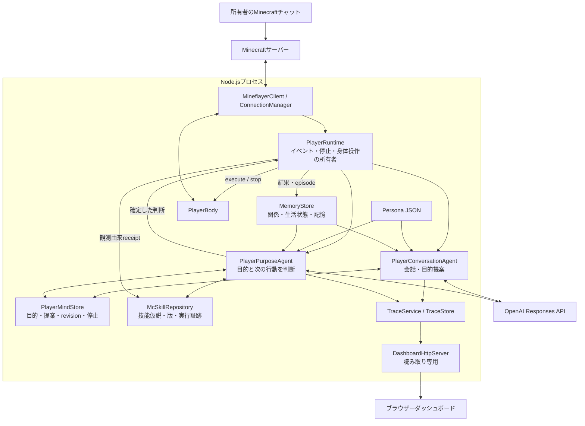

# アーキテクチャ

この文書は **既定の自律AIプレイヤー** の全体構成を説明します。読み進める順序は [README](../README.md#技術文書の読み方) を参照してください。

## 調査基準と読み方

Issue #121 の文書刷新は、2026-10-03 時点の `10e1bdece5a6784856d96fd584100698d3d804f2` を基準に dot が単独でコードを調査して行いました。実装の変更・動作テストは実施していません。以下の図はコードの責務・呼出し関係を表し、実ゲームでの達成保証ではありません。以後のコード変更では対応する文書も更新してください。

- **設計意図**: Minecraftで継続する一人の存在として、人格、関係、共有経験、自分の目的を行動に反映する。
- **実装**: 設定・構造化記憶・観測を大規模言語モデル（LLM）へ渡し、型付きの判断を永続状態へ確定した後、身体操作を実行する。
- **評価**: 発話の自然さ、目的の達成、停止の維持、技能の再利用などを別々に調べる。実装があることと、ある場面で動いたこと、長期に安定することを区別する。

「人格」「思考」「学習」は本システムの設計上の呼称です。内面的な意識や、人間と同等の一般能力を実証したという意味ではありません。

## 起動点とプロセス境界

[入口](../src/index.ts) は設定を検証し、[createApplication](../src/app/application.ts) から [createPlayerApplication](../src/app/player-application.ts) を作ります。Node.js / TypeScript の一つのサーバープロセス内に、会話、目的判断、身体制御、SQLite、観測用HTTPサーバーを組み立てます。ブラウザー側のダッシュボードは別の表示クライアントです。

図の矢印は主要な関係を抽出したものです。たとえば会話の目的提案はMindStoreへ保存し、コールバックでRuntimeを起こします。会話からBodyへ直接操作を送る経路はありません。

## 責務と実コード

| 領域 | 主な責務 | 入口・正本 |
| --- | --- | --- |
| 組立・終了 | 設定、DB、APIクライアント、接続、購読、終了順序 | [player-application.ts](../src/app/player-application.ts) |
| 会話 | 所有者の発話、短期会話文脈、目的提案、停止/再開、記憶依頼 | [agents.ts / PlayerConversationAgent](../src/player/agents.ts) |
| 目的判断 | 観測・目的・記憶・技能を踏まえた行動/待機/継続/完了の選択 | [agents.ts / PlayerPurposeAgent](../src/player/agents.ts) |
| モデル呼出し | strict schema、tool loop、使用量、打切り、context圧縮 | [responses.ts](../src/player/responses.ts) |
| 実行調整 | 意味のある変化で起動、一つのBody操作、割込み、再接続 | [runtime.ts](../src/player/runtime.ts) |
| 意思決定状態 | revision比較、提案とgoalの関連、結果・停止の永続化 | [mind-store.ts](../src/player/mind-store.ts) |
| 身体 | 可視観測、操作schema、Mineflayer操作、結果確認 | [player-body.ts](../src/minecraft/player-body.ts)、[詳細](player-body.md) |
| 人格・長期記憶 | 人格設定、関係、生活状態、既往episodeの保存と検索 | [persona.ts](../src/persona/persona.ts)、[store.ts](../src/memory/store.ts)、[詳細](memory.md) |
| 技能知識 | 検索、版管理、観測証跡による仮説作成・改訂 | [repository.ts](../src/mc-skills/repository.ts)、[詳細](mc-bot-skills.md) |
| 観測性 | 内容を絞ったtrace、集計、読み取り専用画面 | [trace/service.ts](../src/trace/service.ts)、[dashboard](dashboard.md) |

## なぜ会話と行動を分けるのか

長い移動や採掘が続いていても会話を受け取れるように、会話と目的判断は別の呼出しにしています。一方、二者が同時に身体を動かすと競合するため、`PlayerBody.execute()` の所有者は `PlayerRuntime` に集約します。

共有状態の競合には Compare-And-Swap（CAS、読んだ版と現在の版が一致する時だけ更新する方式）を使います。`revision` は判断の前提、`actionRevision` は身体操作の有効性、`stopGeneration` は停止/再開の世代を守ります。これは「モデルが古い回答を返さない」という期待に依存しない仕組みです。詳細と時系列は[自律プレイヤー](autonomous-player.md)にあります。

## 設計上の判断と強制される境界

| 対象 | 誰が決めるか | 注意点 |
| --- | --- | --- |
| 何をしたいか、所有者の提案をどう扱うか | 目的エージェントが人格・目的・観測を材料に判断 | 採用・妥協・辞退の理由とowner goalを保持 |
| 危険、死亡、建築変更への対応 | 目的エージェントが状況から判断 | 旧reflexの固定退避・旧建築認可を既定経路へ持ち込まない |
| 入力の形・同時操作・停止状態 | schema、MindStore、Runtime、Body | 型検証やCASは、目的の妥当性まで保証するものではない |
| ゲーム内の操作可否 | 通常のMinecraft/Bukkit権限と保護plugin | client側の操作受付だけで成功にしない |
| credential、shell、任意コード、server管理 | モデルへ操作手段を公開しない | 既存サーバー設定の変更は別の運用作業 |
| 何を達成したか | 操作後のゲーム観測と、その後の目的判断 | `successful`な一操作とowner goal完了は別 |

## データの流れ

1. 人格JSONと保存済み記憶を読み、現在の観測とMindStoreのsnapshotを揃える。
2. 会話は提案を保存する。目的判断は必要な知識や技能を読み、状態更新と判断をCASで確定する。
3. RuntimeはBodyを実行し、実行前後の観測に基づく結果を受け取る。
4. 結果を技能receipt、episode、MindStoreへ順に記録し、次の判断を起こす。
5. 成功したreceiptがあれば、再利用可能な方法かを学習評価し、技能仮説を作成/改訂する場合がある。

複数storeへの結果記録全体は一つのtransactionではありません。たとえばgoal mirrorの保存失敗はMindStoreの確定を取り消さず、別の失敗として扱います。復旧と保持期間は[人格と記憶](memory.md)、追跡方法は[テスト・評価](testing.md)を参照してください。

## 既定経路とlegacyを混同しない

`createLegacyApplication()` は旧 `ChatCoordinator → OpenAIDeliberationAgent → ToolExecutor → TaskRuntime → skills` を明示的に組み立てる互換・比較用経路です。既定の起動ではこれらの制御主体や `ReflexCoordinator` は起動しません。

- `src/mc-skills/`: 既定プレイヤーが読む**技能知識**。モデルが選び、観測に基づき改訂する。
- `src/skills/`: 旧経路の**決定論的な作業実装**。同じ「skill」という語でも役割が違う。
- `src/runtime/`: 接続等に再利用される小さな共通処理もある。ディレクトリ全体が未使用という意味ではない。
- TreeGuardの旧採掘制限はlegacy設定を有効化した場合の補助。既定Bodyの必須条件ではない。

旧経路の責務・制限・再起動契約は[legacy runtime](legacy-runtime.md)へ分離しています。旧経路の2026-08-25実測結果を、現行プレイヤーの全機能検証へ読み替えないでください。

## 技術選定と変更時の入口

- Node.js / TypeScriptで判断と身体の契約を共通化し、MineflayerでJava Editionへ接続する。
- OpenAIのTypeScript SDKからResponses APIを使用する。model名の既定値は[設定schema](../src/config/schema.ts)を参照する。
- 永続化はSQLite。MindStore、MemoryStore、Skill、Traceは同一DBファイル内の別の責務を持つ。
- 依存versionは [package.json](../package.json) とlockfileを正本にする。既定接続版と26.1クライアントの区別は[接続手順](minecraft-26-1.md)にある。

会話品質なら `PlayerConversationAgent`、行動選択なら `PlayerPurposeAgent`、割込みなら `PlayerRuntime`、結果の真偽なら `PlayerBody`、継続性ならMindStoreとMemoryStore、技能の変化ならMcSkillRepositoryの順に調査対象を絞ります。実行記録を根拠に絞る方法は[評価と原因調査](testing.md)を参照してください。
