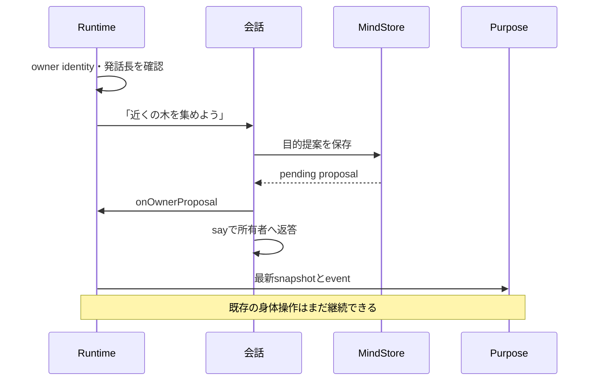
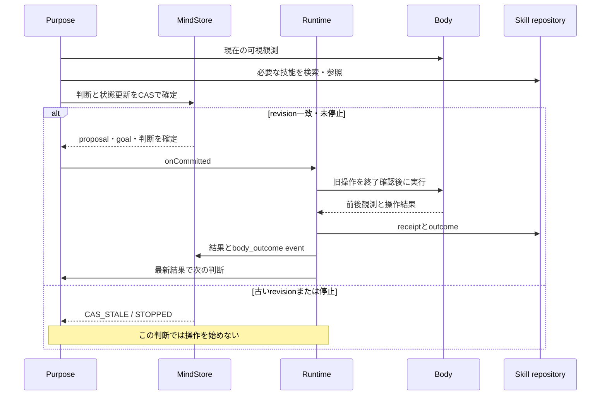
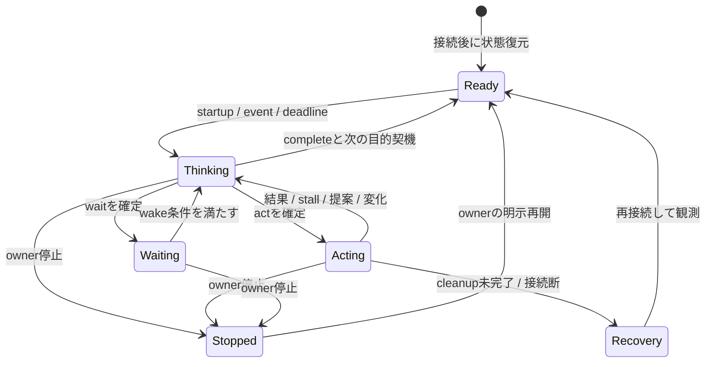
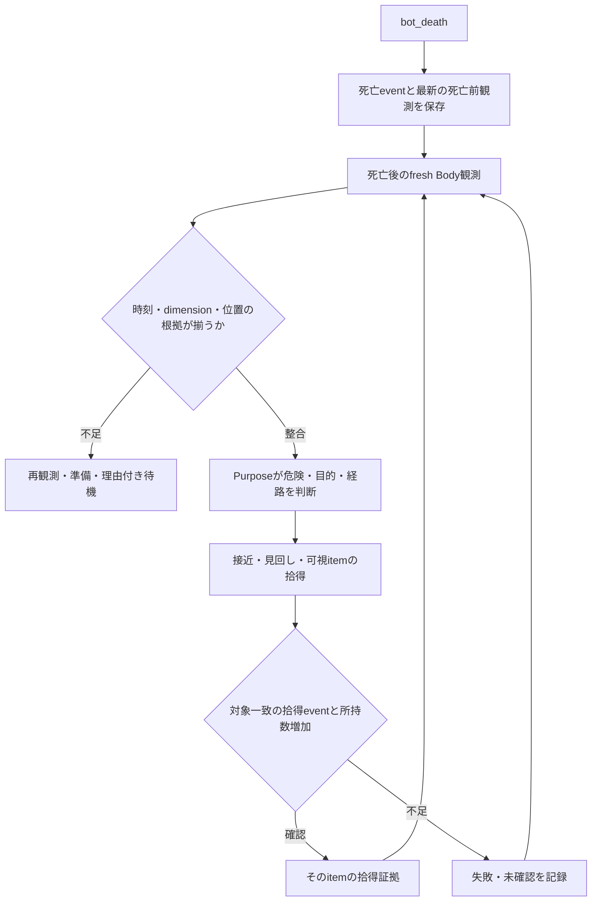

# 自律プレイヤー: 会話から判断・行動へ

[全体構成](architecture.md)を踏まえ、既定の `createPlayerApplication()` が組み立てる制御を説明します。主な実装は [agents.ts](../src/player/agents.ts)、[runtime.ts](../src/player/runtime.ts)、[mind-store.ts](../src/player/mind-store.ts)、型の正本は [contracts.ts](../src/player/contracts.ts) です。以下の場面はコードの流れを説明する架空例で、今回の実ゲーム試験結果ではありません。

## 1. 一人のプレイヤーを三つの責務で構成する

| 責務                           | 入力                                           | 出力・できること                                         | 直接しないこと           |
| ------------------------------ | ---------------------------------------------- | -------------------------------------------------------- | ------------------------ |
| 会話 `PlayerConversationAgent` | ownerの今回の発話、直近会話、persona、保存状態 | 返答、目的提案、明示的な記憶、停止/再開                  | Body操作                 |
| 目的 `PlayerPurposeAgent`      | 現在観測、目的・提案、記憶、技能、event        | 理由付きの `act / wait / continue / complete` と状態更新 | 確定前のBody dispatch    |
| 実行 `PlayerRuntime`           | 確定判断、Body event、owner chat               | 一つのBody操作の所有、停止、中断、結果保存、次の判断起動 | 独立したゲーム目的の生成 |

会話と目的は同じ設定modelを使う別のResponses呼出しです。別OSプロセスではありません。各目的判断内では `parallel_tool_calls: false`、Runtimeも目的判断を一つずつ進めます。一方、会話turnは長い身体操作の終了を待たずに受け付けられます。

## 2. 具体例: 探索中に採集を頼まれたら

まず、所有者の発話を目的判断へ渡します。

次に、目的を判断・確定し、操作結果から次の判断へ進みます。

図は採用される場合を例にしています。目的エージェントは目的との釣り合いを見て、採用・妥協・辞退を選べます。辞退からowner goalは自動生成しません。採用/妥協では元のproposalとowner goalを関連付け、理由を残します。

ここで重要なのは、会話の了承、判断のcommit、Body操作開始、操作成功、依頼全体の達成が**別の出来事**であることです。たとえば `dig` の成功は対象blockの破壊確認であり、原木の拾得や依頼全体の完了を意味しません。

## 3. 会話の入力と出力

`handleOwnerMessage()` はowner identityと最新turnを確認します。非ownerのchatはRuntime入口でも除外します。

| tool                                | 効果                                                   |
| ----------------------------------- | ------------------------------------------------------ |
| `propose_goal_change`               | proposalを永続化し、目的判断へ通知                     |
| `remember_owner_fact`               | ownerが明示的に記憶を求めた事実の要約をMindStoreへ保存 |
| `stop_autonomy` / `resume_autonomy` | 停止世代を照合して永続停止/再開                        |
| `inspect_player_status`             | 保存済みruntime状態を読む                              |
| `search_memory`                     | MemoryStoreの関連記憶を検索                            |

モデルには、雑談・能力相談だけで行動提案を作らないこと、今回の発話と直近4件までの会話を合わせて指示語を解釈することを指示します。これは意味判断の指示であり、あらゆる発話を正しく分類する保証ではありません。

返答は送信成功後にだけ短期会話文脈へ記録します。240文字を超える返答は最新状態を使い、toolなしで一度だけ短く再生成します。失敗または再超過時は短い案内へ置き換えます。最終Minecraft chat送信でも改行を平坦化し、slash command化を防ぎます（[sanitizeMinecraftChatText](../src/app/player-application.ts)）。

即時停止語の完全一致は会話LLMを通りません。それ以外の停止/再開は、今回のowner発話の意味をモデルが判断してtoolを呼びます。古いturnが新しい状態を上書きしないよう、turnと `stopGeneration` を照合します。

## 4. 目的判断に何を渡すか

`think()` はBodyの初回観測を取り、snapshotのrevisionがまだ一致し、停止されていないことを確認してResponsesへ進みます。

| 入力             | 内容                                                  | 注意点                                   |
| ---------------- | ----------------------------------------------------- | ---------------------------------------- |
| instructions     | PersonaCore、関心・goal、判断原則、操作catalog        | personaは行動選択の材料。権限を作らない  |
| `runtime`        | 目的、提案、facts/uncertainties、停止、操作、直近結果 | `compactSnapshot()`で件数を絞る          |
| `memory`         | 関係、LifeState、MemoryStore検索結果                  | 読み込める構造と、自動更新される構造は別 |
| `observation`    | 自身、所持品、可視block/entity、画面、向き            | 見えない対象の現在位置は補わない         |
| `events`         | 判断を起こした出来事と時刻                            | commit後にだけ対象eventをconsume         |
| `spatialHistory` | 以前に実際に見た可視block範囲                         | 過去の範囲が今も通行可能とは限らない     |
| `deathRecovery`  | 死亡記録と今回観測の整合性                            | 死亡前位置をdropの確定位置にしない       |

人格・記憶の保持先と入力件数は[人格と記憶](memory.md)にまとめています。世界の看板、本、表示名、画面タイトル等は `untrustedWorldAuthoredText` として出所を分け、世界内の情報として読みます。system指示やowner認可、停止を上書きする命令にはしません。

### 必要な情報を追加で得るtool

- `observe_body`: 初回観測が得られなかった場合の補完。初回観測がある判断ではtool一覧から外す。
- `locate_owner`: pending proposal、または採用/妥協されactiveなowner-linked goalに限り位置の特例観測。
- `ask_body_knowledge`: Minecraft registryのitem/block/entity等を英語IDで照会。レシピ等の推論は事実と分ける。
- `describe_operation`: 現行schemaを取得。31操作の正本は [player-body-schema.ts](../src/minecraft/player-body-schema.ts)。
- `search_skills` / `read_skill` / `read_skill_history`: 技能候補、本文、版履歴を読む。検索語句不一致時は基礎7分類の候補を返す。
- `search_memory`: 既往の事実や結果を検索。
- `export_skill_markdown` / `import_skill_markdown`: 専用交換領域だけで技能を交換。
- `propose_skill_learning`: receiptに対応する技能仮説を作成/改訂。

`look`、`move_to`、`move_relative`、`dig`には短い入力署名を先に提示します。参照した操作schemaは直近4種・合計4,096文字以内で再提示します。引数が不正なら現行schemaを返して修正でき、未知の引数を推測実行しません。

## 5. 判断の確定と競合

`commit_action_decision` は操作JSONを [playerOperationSchema](../src/minecraft/player-body-schema.ts) で検証し、必要なgoal更新・proposal解決・理解更新を `stateUpdates` に含めて `PlayerMindStore.commitThought()` へ渡します。

| 判断       | 永続状態への効果                               | Runtimeの動き                                    |
| ---------- | ---------------------------------------------- | ------------------------------------------------ |
| `act`      | purpose、activeOperation、actionRevisionを更新 | 旧操作を中断・終了確認後に置換                   |
| `continue` | 既存操作を維持。一般revisionは更新し得る       | activeOperationが必要。身体を再dispatchしない    |
| `wait`     | 理由・wakeOn・任意wakeAtを保存し操作を解除     | 身体を止め、条件を満たすイベントを待つ           |
| `complete` | 現在purposeを閉じ、待機条件と完了契機を保存    | 身体を止め、進捗に対応する次の自律判断を一度起動 |

`complete` とowner goalの `completed` 更新は別です。owner intentを完了/放棄するには明示的なgoal更新が必要です。自発的な中間goalを終えてもowner intentを消しません。active/pausedなowner-linked goalとproposalは入力の件数制限でも保持し、paused goalを自動再開しません。

### 三つの世代値

- `revision`: 判断開始時に読んだ状態が最新かを比較する。操作結果や提案等で進む。
- `actionRevision`: 新しい操作・待機・停止等に切り替わったかを比較する。`continue`では進行中操作の版を変えない。
- `stopGeneration`: 停止/再開の前後で古い会話toolが状態を戻さないために照合する。

停止またはCAS不一致は同じthought内の再試行を終え、最新状態で再判断します。進行中操作のない `continue`、pendingでないproposal、不正な操作入力などは理由付きで返します。

MindStoreのCAS成功時に `onCommitted` でRuntimeへ通知し、余分な最終LLM roundを待たずdispatchへ進みます。goalをMemoryStoreのLifeStateへ写す処理は後続であり、失敗しても確定判断は維持します。戻り値 `goalMemoryPersisted: false` と警告を調査します。

## 6. イベント・待機・割込み

図は概念上の状態です。`Thinking` と `Acting` は重なり得ます（操作を続けながら次の判断をする）。SQLiteの単一enumとして実装されている図ではありません。

| 契機               | 進行中の目的判断への扱い                                                                      |
| ------------------ | --------------------------------------------------------------------------------------------- |
| owner proposal     | HTTP待ちなら最大30秒だけ応答・usage記録を待つ。HTTP外の観測待ちは中断。後続の古いtoolを止める |
| Body outcome       | revisionを進め、HTTP応答とusage記録後に古いtool/次roundを止める                               |
| 通常の周囲変化     | 思考中はrevisionを進めずeventを保存し、判断終了後に渡す                                       |
| vitals等の重要変化 | 未commit thoughtを中断して新しい観測で再判断                                                  |
| stop / shutdown    | thoughtを即時中断、保留wakeを破棄、Bodyを停止                                                 |

owner proposalの連続到着で30秒期限は延長しません。期限内にHTTPが終了しなければabortし、使用量不明を記録します。通常の周囲変化でcommit済みの操作所有権を捨てません。

イベント購読に加え15秒のsamplerが意味のある変化を補足します。vitalsは3秒、timeを含む変化は60秒、通常の意味変化は12秒の間隔で集約します。移動中の位置変化だけでは再判断しません。酸素の通常変化を一律に緊急扱いせず、低酸素等をvitalsとして扱います。

`wait.wakeOn` と未来の `wakeAt` は通常wakeを絞ります。owner proposalなどの例外、受理済み保留wake、完了後の一度のwakeはRuntimeが区別します。判断失敗は5秒から最大60秒へbackoffします。個々のtool loopは既定6 roundですが、プレイ全体の費用上限とは別です。

## 7. 身体操作・結果・再起動

Runtimeは現在の操作をcancelし、そのpromiseがsettleした後、最新 `actionRevision`・operation ID・停止状態を再確認して次を始めます。`activeOperation.startedAt` はcommit時に設定され、Body開始eventでも互換更新されます。実際にBody開始を観測した時刻は `bodyStartedAt` を使います。

結果保存の順序は、Bodyのafter観測 → McSkillRepositoryのtrusted receipt/outcome → MemoryStoreのepisode → MindStoreの結果とeventです。複数storeをまたぐ単一transactionではありません。receipt保存失敗は `PLAYER_SKILL_EVIDENCE_FAILED` として記録され、モデルの成功申告で補いません。

通常のowner goalの終了判断は次のPurposeへ戻します。食事依頼の結果と装備結果にはRuntimeの専用通知もあり、食事は所持数減少とfood増加、装備は実slotのitemを照合して説明します。

キャンセルしてもnative処理が残る場合、Bodyは `recoveryRequired` を返し、Runtimeは通常の再接続経路へ依頼します。再接続まで次の操作を開始せず、再接続設定が無効ならそれを迂回しません。

再起動では保存済みactiveOperationをそのまま再実行しません。一致するtrusted receiptがあれば結果へ使い、なければ `unverified` として閉じて再判断します。停止ラッチは維持します。詳しい保存先は[人格と記憶](memory.md)を参照してください。

## 8. 具体例: 死亡後の探索

- 死亡前の最終観測位置は、死亡地点やdropの位置を保証しない。
- 死亡後最初の観測を別欄へ保存し、欠けた値を推測しない。
- `[death-recovery:…]` marker付き操作は、時刻・dimensionと現在観測の整合性を検証する。
- `approach / sweep / collect` は試行履歴。過去に使ったという理由だけで固定拒否しない。
- 危険の観測は判断材料。固定の一律禁止条件にはしない。
- 拾得成功でも「死亡drop由来」「持ち物全回収」は別の証明が必要。
- 再接続後は古い回収操作を `continue` せず、fresh観測で再計画する。

死亡eventをまたぐ累積retry上限はなく、無進捗の連続wakeを常に防げることは未実証です。過去の限定測定は[AIプレイヤーE2E](ai-player-e2e.md)の死亡回収節を参照してください。

### 経路が詰まった時の判断材料

現在のPurpose instructionsには、activeなowner goalのため所有者へ移動中にstallした場合の、閉じた手動ドアの回復手順があります。fresh観測でドアを確認し、必要なら一度見回し、向きと閉状態を再確認して一度使用します。`open=true` と新しいowner位置が確認できた時だけ移動を一度再試行し、根拠がなければ別経路または未達の理由を選びます。

これはモデルへの手順指示です。回復回数を独立した永続カウンターで強制しているという意味ではありません。履歴から再試行済みか分からない場合にも、同じ手順を繰り返さないよう指示しています。関連する `recentActionPattern` と可視観測を合わせて評価します。実装箇所は [PlayerPurposeAgent.think](../src/player/agents.ts)、操作条件は [PlayerBody](player-body.md) です。

## 9. 読み終えた後に確認するもの

- 人格・関係の読込みと実際の更新経路: [memory.md](memory.md)
- 操作単体の観測範囲と結果条件: [player-body.md](player-body.md)
- receiptから再利用可能な技能へ戻る流れ: [mc-bot-skills.md](mc-bot-skills.md)
- 判断拒否、未達、使用量不明を調べる: [testing.md](testing.md)

実ゲームrunごとの経緯は評価文書へ集約します。異なるworld・入力・予算のrun間の値を、そのまま改善率として比較しません。
