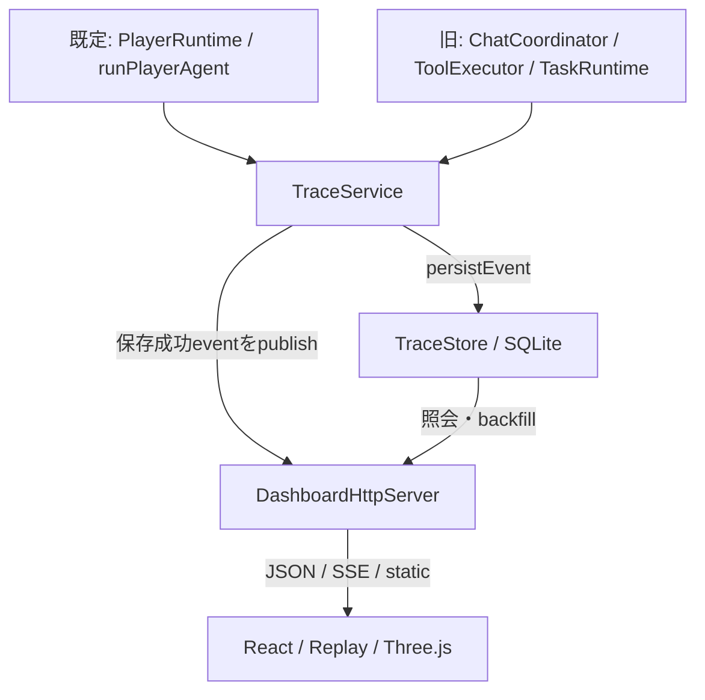

# ダッシュボードアーキテクチャ

## 範囲

dashboard は bot runtime の観測層です。runtime の成功判定、Minecraft 操作、会話、memory、停止処理を置き換えません。dashboard の停止、描画失敗、trace 保存失敗は、bot の主処理へ別の成功・失敗を注入しません。

## データフロー

既定Playerとlegacyでは計測点が異なります。schemaにあるすべてのstageが両経路で生成されるわけではありません。

アプリケーション起動時には TraceStore と TraceService を構成し、dashboard server の起動を試みてから Minecraft 接続へ進みます。dashboard の構成・bind・start に失敗した場合は observability の error を記録し、bot 起動そのものを dashboard の成功に依存させません。既定Playerの終了ではRuntimeと接続を止めてからdashboardと各storeを閉じます。詳細な順序は `PlayerCompanionApplication.shutdown()` を正本とします。

TraceStore と既存の memory store は同じ SQLite database path を使いますが、trace は専用の `trace_*` tables と schema migration に分離されています。trace の API は memory record を直接公開しません。

## 既定AIプレイヤーの計測点

| 実装箇所                                                          | 記録                                                    | 限界                                                |
| ----------------------------------------------------------------- | ------------------------------------------------------- | --------------------------------------------------- |
| [PlayerRuntime](../../src/player/runtime.ts)                      | owner会話turn / 目的thoughtのtrace                      | thoughtが返ると閉じる。Bodyやgoalの達成保証ではない |
| [runPlayerAgent](../../src/player/responses.ts)                   | Responsesのdeliberation span、latency/token             | tool結果の安全な詳細は別のround activity            |
| [ConnectionManager](../../src/minecraft/connection-manager.ts)    | 接続retryのrecovery span（有効なtrace sessionがある時） | sessionがない時は生成しない。ゲーム行動の成功とは別 |
| [PlayerCompanionApplication](../../src/app/player-application.ts) | read-only health callback                               | 完全なMindStoreやworldをHTTPへそのまま公開しない    |

Body結果はMindStoreとSkill receiptに保存されます。既定経路ではBody操作・結果検証・学習改訂を、判断traceへ一続きに結ぶ計測が不足しています（[Issue #123](https://github.com/stillshore-chirp/mc-bot-egent-practice-2/issues/123)）。現状の調査手順は[テスト・評価](../testing.md)に記載します。

## 旧tool/runtimeの計測点

| 実装箇所                      | 記録する stage / 状態                                                               |
| ----------------------------- | ----------------------------------------------------------------------------------- |
| `ChatCoordinator`             | request root、response、cancellation、runtime 再評価時の recovery、trace completion |
| `CompanionContextFactory`     | context、memory_read、perception                                                    |
| `OpenAIDeliberationAgent`     | deliberation、モデル latency / token metrics の構造化値、tool loop                  |
| `ToolExecutor`                | tool、memory_read、memory_write、minecraft_action、verification、cancellation       |
| `TaskRuntime`                 | skill の開始、完了、待機、失敗、cancel、timeout の summary                          |
| `Application`                 | system 接続、reflex、runtime 状態、dashboard health                                 |
| `TraceService` / `TraceStore` | sequence、persist-before-publish、dedupe、schema 検証、retention、demo-safe         |

schema に定義された stage であっても、対応する実処理が発生しないときに placeholder span を生成しません。実装が外部化した構造化 summary だけを表示します。

## 永続化と配信

`TraceSession` は root span と子 span を sequence 付き event として作成します。`TraceService.persistAndPublish` は TraceStore への保存が成功した event だけを subscriber へ渡します。保存に失敗すると session の persistence を無効化し、health を `degraded` にして構造化 error を記録します。観測性の失敗で主処理を二重実行しないよう、runtime 側は trace 操作を best effort として扱います。

SSE は接続時に `Last-Event-ID` を読み、SQLite の `stream_id` を基準に欠落 event を再送します。backfill はページ単位で続行し、接続ごとの送信バッファが上限を超えた場合は接続を終了します。ブラウザ側は event ID / stream ID の重複、順序逆転、gap を検出し、観測性劣化として表示します。

## HTTP と UI

HTTP server は API を先に処理し、`/api/` 以外の GET / HEAD だけを静的ファイルへ渡します。static path は root から外へ解決できないよう検査します。JSON は no-store、static index は no-store、asset は immutable cache です。CSP、same-origin、no-referrer などの response header を付与します。

React UI は `useDashboardData` で health、trace list、detail、events、SSE を取得します。Live と Replay は同じ `traceReducer` の event 適用処理を使い、Replay は保存済み event の prefix を reducer へ渡します。Three.js scene は DOM の node list、Inspector、Timeline と同期し、3D を利用できない場合も同じ trace state を 2D SVG と DOM へ渡します。

## 実行境界

製品 build に fake Minecraft、fake OpenAI、fake stream、demo generator、固定成功 trace は含めません。fake client と架空 fixture は unit / integration / browser test 内に限定されます。現行 latest HEAD の実 Minecraft・実 OpenAI E2E は未実施です。
