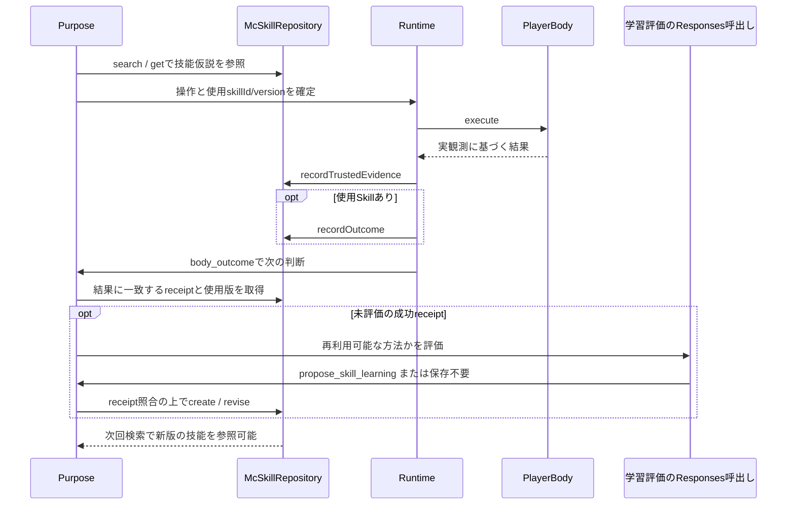

# MC Bot Skill リポジトリ

MC Bot Skill は、Minecraftで繰り返し使える行動の要点を、目的・適用条件・本文・操作名・期待結果・confidenceと一緒に保存する構造化記録です。SQLiteが正本で、Markdownは交換用のコピーです。検索では要約だけを返し、必要な時に `get(skillId)` で本文を読みます。初期データにはサバイバル、探索、戦闘、採集、クラフト、建築、移動の7分類を入れます。

## 目的判断に戻る学習ループ

実装の正本は [repository.ts](../src/mc-skills/repository.ts)、学習提案を受ける窓口は [PlayerPurposeAgent.recordLearning](../src/player/agents.ts)、ゲーム結果の書込み元は [PlayerRuntimeのexecuteBody](../src/player/runtime.ts) です。

ここでの学習は、モデルの重みを再学習する処理ではありません。観測された試行から、次に読み直せる技能文書と版・根拠を作る仕組みです。



### 誰が何を信用するか

| 要素                  | 作成者                                   | 意味                                             |
| --------------------- | ---------------------------------------- | ------------------------------------------------ |
| Skill本文・confidence | モデル等の提案をrepositoryが検証して保存 | 再利用候補の仮説。成功保証ではない               |
| trusted receipt       | RuntimeのBody結果記録経路                | 観測された操作と結果。モデルにwriterを公開しない |
| native outcome        | receiptを照合するrepository              | 実使用Skillの試行結果を一度だけ統計へ反映        |
| immutable revision    | repository transaction                   | どの版を何の根拠で変えたかを保持                 |
| imported statistics   | Markdown交換からの外部情報               | 自分のnative experienceと混ぜない                |

### 自動評価の条件と限界

`PlayerPurposeAgent.think()` は、`body_outcome` eventと直近結果が一致し、成功receiptのoperation・使用Skill/版・期待結果も一致した場合に、独立した学習評価用Responses呼出しを行います。この「独立」は製品内の役割分離であり、別OSプロセスではありません。

- 再利用できる方法なら一回の成功から仮説を作れる。反復成功を作成の必須条件にはしない。
- 同等Skill、単発でしか使えない結果なら、評価しても保存しない場合がある。
- 使用Skillありの自動評価では使用版の改訂を、使用Skillなしでは作成を提案する。
- 通常のPurpose toolからも `propose_skill_learning` を使える。作成には成功receipt、改訂には成功/失敗receiptと使用版の一致が必要。
- Skillの保存、MindStoreのlearning参照、後の実使用は別の事象。保存件数だけで能力向上を評価しない。
- 学習評価を試したrunの直近24件の集合はプロセス内にあり、保存済みlearning参照とは別。再起動後まで「評価したが保存しなかった」履歴を無制限に保持する仕組みではない。

学習の評価は「receipt → revision → 後続の使用版 → 新しい結果」を辿ります。具体的な確認先は[評価と原因調査](testing.md)を参照してください。

## 保存と公開API

`McSkillRepository.open({ databasePath, exchangeDirectory, allowedOperationNames })` で開きます。リポジトリは独自の `mc_bot_skill_*` テーブルだけを `CREATE TABLE IF NOT EXISTS` で作るため、既存SQLite DBと同じファイルを使っても既存の記憶schemaを変更しません。通常の検索、取得、編集は `search`、`get`、`getHistory`、`createSkill`、`revise`、`reviseFromEvidence`、`listOutcomes`、`getEvidence` を使います。

`revise` は `expectedVersion` を受け取り、現在versionが一致しない編集を拒否します。変更前の本文・条件・操作参照・期待結果・confidenceはrevisionテーブルに残り、更新・削除できないDB triggerで保護します。`changeKind` は `revise`、`merge`、`weaken` を記録する分類です。初期Skillのconfidenceは実績がないため0です。confidenceはnative outcomeの件数と証跡を見てrevisionとして更新しますが、その値で新しい試行を拒否しません。

## 実行証跡

`recordTrustedEvidence` はゲーム観測・検証のコード経路からのみ呼びます。このwriterをGPT/model inputから発行したり、GPT toolとして公開したりしません。GPTの成功申告や失敗申告はtrusted receiptになりません。receiptにはrun ID、許可されたoperation名、簡潔な入力要約、条件、期待結果、観測結果を保存します。Skillの実行中であればskill IDとその時に使ったversionも渡します。receiptがSkill実行時のversionを持つ場合は、そのrevisionのoperation参照も照合します。新規Skillへの接続では、そのSkillがreceiptのoperation名を参照している必要があります。

`recordOutcome` の `proposedOutcome` は呼び出し側の申告です。一致するreceiptがなければ提案が成功・失敗・中断・cancelのどれでも保存statusは `unverified` になり、native統計へ成功・失敗を加えません。receiptに観測された結果が正本です。最初のverified successful runだけをSkillごとの `successHypothesis` として記録し、後続の成功試行は独立した証跡として残します。run IDはreceiptとoutcomeそれぞれで一意なので、同一runの再送で件数は増えません。cancelledとinterruptedは別statusです。

`reviseFromEvidence({ runId, ...revision })` は、成功または失敗を観測したtrusted receiptが実際に使ったSkillとversionを同一transaction内で照合し、そのreceiptを直後のimmutable revisionへ結びます。条件、本文、期待結果、confidenceのいずれかに実質的な変更が必要です。receipt/run、Skill/version、改訂版の不一致、古いversion、同一receiptへの異なる改訂は拒否されます。同じrunと同じ改訂内容の再送は既存の証跡リンクを返し、revisionやlearning counterを重ねて増やしません。改訂保存と証跡リンク挿入は一体でcommitまたはrollbackされ、リンクは更新・削除できません。`getEvidenceRevision(runId)` と `listEvidenceRevisions(skillId)` で対応を検証できます。通常の `revise` は引き続き利用できますが、trusted receiptに基づく学習ではこのAPIを使います。

Player learning facadeの`revise`入力は`operationRefs`を受け取りません。receiptに記録されたSkill/versionのimmutable定義から参照一覧を読み、そのまま改訂へ渡します。使用版がreceiptのoperationを参照していなければ改訂を拒否し、モデル提案の参照追加で補正しません。これによりreceiptに結び付く操作参照と、使用版から保持する既存参照が一致します。

`createHypothesisFromEvidence({ runId, input })` は、GPTの提案を受け取った学習facadeから呼べます。repositoryは既存のtrusted successful receiptを読み直し、receiptのoperation参照とrun単位の重複をtransaction内で検証してから新しいSkill仮説を作ります。GPTが申告した結果だけでreceiptを作る経路はありません。receiptのoperationを新Skillの`operationRefs`に含める必要があります。既存Skillの使用receiptなら証跡とのimmutableな関連だけを追加し、使用Skillのnative outcomeや件数を変更しません。事前にSkillが割り当てられていないreceiptなら、新Skill、初回revision、最初のnative successful outcome、証跡関連を一つのtransactionで保存します。同じrun・同じ内容の再要求は初回のSkill IDを返し、タイトルなど内容を変えて同じrunを再利用するとconflictになります。`listDerivedHypotheses(skillId)`で関連IDを取得し、`getEvidence(runId)`でreceiptを参照できます。`recordTrustedEvidence`は引き続きモデル入力から隔離されたゲーム観測・検証経路専用writerです。

証跡には会話全文、LLM入出力、raw log、Minecraft username、UUID、IP、server address、座標などを渡さず、必要な事実だけを一般化してください。Skill本文は目的や周囲に合わせた行動判断の参考です。利用者の停止指示、Minecraftサーバーが実際に設定した権限、接続先サービスのアクセス制御に従い、Bot独自の固定禁止や強制退避を追加するためには使いません。

## Markdown交換

`exportSkill(skillId, fileName?)` と `importSkill(fileName)` は、open時に設定した交換directory内のMarkdownファイル名だけを受け取ります。`..`、区切り文字、symbolic link、regular fileでないentryを拒否します。読み込み時は `O_NOFOLLOW` とfile descriptorのsize確認を使い、canonical pathが交換directory内にあることを再確認します。交換ファイルはresource limitとして64 KiBまでです。

ファイルは `mc-bot-skill` fenced JSON metadata（schema version 1）と `## 本文` セクションで構成します。metadataにはSkill ID/version、base digest、native outcome集計、import済み統計と各provenanceが入ります。export元のprovenanceにはDBごとに永続化するsynthetic UUIDを含め、別DBで中継してもimport済みのsource provenanceを保持します。本文はfenceの後ろに一度だけ書きます。import時にJSON schema、version、本文見出し、利用側から渡された `allowedOperationNames` を検証し、内容はデータとしてのみ扱います。SQLite側のSkill payloadは48 KiB、証跡とoutcome payloadは各16 KiB、交換Markdownは64 KiBまでのresource boundを設けます。

既存Skillへの編集importはexport時のbase versionとdigestが現在記録に一致する場合だけ適用し、immutable revisionを一つ追加します。別の更新が先に入っていればversion conflictになります。同じsource ID/versionと内容の再importはidempotentです。native outcomeはoutcome行から算出し、import統計は移入先Skill・source ID/version・provenanceごとの別テーブルに保持します。各versionの統計は独立したprovenance snapshotとして置き、異なるversionの値を実行回数として加算しません。再importでは同じsnapshotを置き換えるため、外部統計がnative experienceに混ざりません。再exportでもnativeとimport済み統計を別々に運びます。派生仮説のreceipt関連はlocal SQLite内に保持し、交換Markdownにはrun IDやreceipt内容を含めません。import先では元receiptを直接取得できず、Skill定義とnative/import統計のprovenance snapshotを参照します。

本文例:

````markdown
# 高低差のある場所を移動する

```mc-bot-skill
{"kind":"mc-bot-skill","schemaVersion":1,"sourceVersion":1,"baseDigest":"dd997ddf4d61681697fdda43bdc854744402e61ff4e5d1b0c11ac485c67a7976","skill":{"id":"sample-navigation","category":"navigation","title":"高低差のある場所を移動する","purpose":"地形に合わせて目的地へ向かう","conditions":["高低差がある"],"operationRefs":["look","move_to"],"expectedOutcome":"到着位置を観測する","confidence":0},"statistics":{"native":{"successful":0,"failed":0,"interrupted":0,"cancelled":0,"unverified":0},"imported":[]},"provenance":"sample"}
```

## 本文

目的と地形、周囲の危険を確かめて経路を選ぶ。進み方を観測結果に合わせて調整し、到着または次の選択肢を確認する。
````
