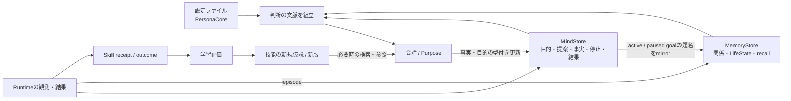
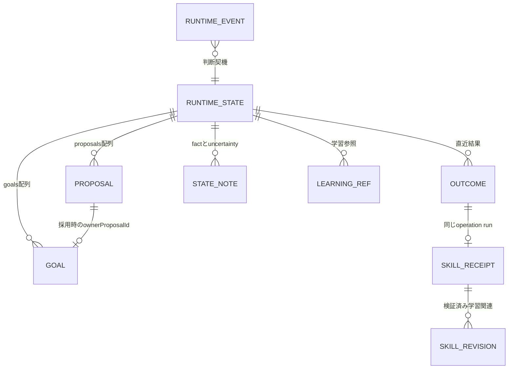

# 人格と記憶: 保持・更新・判断入力

既定プレイヤーの組立は [player-application.ts](../src/app/player-application.ts)、判断入力は [agents.ts](../src/player/agents.ts) にあります。人格の継続性は、安定した設定と更新可能な状態を毎回の判断へ渡す設計で支えます。モデルが内部で永続的な人格を獲得したと証明する仕組みではありません。

## 1. 何がどこに残るか

| 保存先                     | 内容                                                           | 再起動                    | 主な更新元                                        |
| -------------------------- | -------------------------------------------------------------- | ------------------------- | ------------------------------------------------- |
| Persona JSON               | 名前、話し方、価値観、行動原則、禁止事項、version              | ファイルから再読込        | 人が設定を変更。会話から自動改訂しない            |
| MemoryStore / SQLite       | 関係、LifeState、事実、場所、約束、episode等                   | 同じDBから復元            | 既定経路では主にgoal mirrorと観測episode          |
| PlayerMindStore / SQLite   | goals、proposals、facts、uncertainties、停止、結果、観測、集計 | 同じDBから復元            | 会話tool、PurposeのCAS、Runtimeの観測・結果       |
| McSkillRepository / SQLite | 技能の定義と版、receipt、outcome、学習関連                     | 同じDBから復元            | Runtimeの観測証跡、モデル提案を検証するrepository |
| TraceStore / SQLite        | trace/run/span/event/result                                    | 保存済みtraceをReplay可能 | TraceService。保存期間/件数の整理は別             |
| 会話エージェントのメモリー | 直近owner会話4件、送信できた返答                               | 消える                    | 今回の会話。停止世代の変更でも破棄                |
| Runtimeのメモリー          | AbortController、実行promise、timer、集約中wake                | 消える                    | イベントと操作進行                                |
| Purposeのメモリー          | 直近の操作schemaキャッシュ、学習評価試行の集合                 | 消える                    | schema参照、学習評価                              |

同じSQLiteファイルを使っても、各storeは別の接続・テーブル・transactionを持ちます。全保存を一括commitする設計ではありません。DBを持たない状態へ黙って切り替えるfallbackもありません。

## 2. 人格が判断に働く場所

[PersonaCore schema](../src/persona/persona.ts) は `version / name / speakingStyle / values / operatingPrinciples / prohibitions` を検証します。正本例は [persona.example.json](../config/persona.example.json) です。

`PlayerMemoryPort.context()` はPersonaCoreへ保存済みの `currentInterests` とMindStoreのgoalsを加え、JSON文字列として返します。会話・Purposeはこれをinstructionsへ含めます。関係、LifeState、recallの結果は別の構造化入力です。

したがって、同じ場面でも価値観やgoalが選択理由へ影響することを狙っています。しかし、personaが常に守られるか、関係の表現が自然かは出力の評価が必要です。型が正しいことだけでは人格品質を保証しません。

## 3. 「読む状態」と「更新する状態」を区別する

| 状態                          | 既定プレイヤーで確認できる接続                  | 過大に解釈しない点                                               |
| ----------------------------- | ----------------------------------------------- | ---------------------------------------------------------------- |
| 関係 `relationships`          | `getRelationship(owner.id)` を入力へ渡す        | 会話のたびにtrust/intimacyを自動更新する配線は、この組立にはない |
| LifeStateの関心・拠点・所持品 | 保存済み値を読む。初回は空状態を作る            | 全フィールドがプレイに合わせ自動変化するわけではない             |
| LifeStateの長期目標           | active/paused goalの題名を最大24件mirror        | 目的の正本はMindStore。mirror失敗でも目的commitは残る            |
| 明示的なowner記憶             | `remember_owner_fact → commitUnderstanding`     | 保存先はMindStoreの `stateFacts`。旧 `facts` 表への登録ではない  |
| 観測episode                   | Body結果・死亡を短い要約としてMemoryStoreへ保存 | 生の会話や全操作詳細の無制限アーカイブではない                   |
| BehaviorMemory・場所・約束等  | MemoryStoreにschema/APIと旧経路の機能がある     | 旧toolによる登録/訂正/履行判定が既定経路でも動くとは限らない     |

例として「次回も覚えて」と依頼した事実は、会話toolが短い要約を保存できた時にだけ保存済みと返します。全文の転記は拒否し、同一owner factの重複を避けます。ただしfactsは件数上限があるため、永久保存や必ず次回思い出すことまでは保証しません。

## 4. MindStoreの状態と関連

これは**論理関係図**です。GOAL等が独立SQLテーブルという意味ではありません。MindStoreでは `player_runtime_state` のsingleton JSONへ多くの状態を保存し、イベントは `player_runtime_events`、視点履歴は `player_spatial_views` に分けます。

- proposal: `pending → adopted / compromised / declined`。採用/妥協時はowner goalと関連付ける。
- goal: `active / paused / completed / abandoned`。同名のself goalとowner goalは由来を区別する。
- fact / uncertainty: sourceを `owner / observed / inferred` として保持。意味の正しさはモデル判断も含む。
- operation: kind、内部ID、actionRevision、期待結果、使用Skillの版等を保持。
- death: event時刻と、それ以前の最終観測、死亡後最初の観測を区別する。

CASは [commitThought / commitGoalState / commitUnderstanding](../src/player/mind-store.ts) で行います。思考中に別の提案や結果が入れば古いrevisionによる更新を拒否します。API使用量や最新観測など、すべての書込みがrevisionを進めるわけではありません。

### 保持上限とモデル入力への削減

| データ                | DB側の主な保持                              | 一回の判断入力                               |
| --------------------- | ------------------------------------------- | -------------------------------------------- |
| facts / uncertainties | 各直近40件                                  | 各直近12件                                   |
| judgments / outcomes  | 各直近24件                                  | 各直近4件。省略数も付記                      |
| 過去の移動結果        | outcomes内                                  | 古い移動結果の直近8件を短縮                  |
| 視点履歴              | 最大7視点。反復視点は統合                   | 現在観測と重複しない同dimensionの履歴        |
| agent activity        | 直近64 round                                | 通常の判断入力へ丸ごと再投入しない           |
| skill activity        | 直近32件                                    | 直近12件。ローカルpathを除く                 |
| goal / proposal       | 有界で、継続ownerリンクを保護               | 直近分に加えactive/pausedなownerリンクを保持 |
| 未処理event           | 通常eventは上限を設け、死亡・提案等は別扱い | 一回のthoughtへ最大32件                      |

consume済みeventの7日超分はconsume時に整理します。MindStoreは全プレイ履歴の監査ログではありません。短縮された移動差分は保持中の観測の範囲だけを示し、対象への距離や経路成功の証明にはなりません。

## 5. MemoryStoreの検索と旧経路

[MemoryStore.recall](../src/memory/store.ts) はSQLite FTS5（全文検索）を使います。queryが空ならownerに属する索引を新しい順で取り、queryがあれば検索します。既定contextは `MEMORY_CONTEXT_LIMIT`（既定12）のrecallを取得し、`compactMemory()`で最大10件を渡します。明示的なsearch toolは会話側最大6件、Purpose側最大8件です。embedding/vector検索は実装していません。

MemoryStoreのschema versionは5です。関係、事実、場所、約束、episode、task、LifeState、WorldMemory、BehaviorMemory等を保持します。

- `facts` とWorldMemoryはsource・状態・訂正/撤回の情報を持つ。
- LifeStateはcompanion全体のsingleton。Locationは利用者と名前で対応付ける。
- 旧Commitmentには型付き履行条件とreceiptによる完了確認がある。
- 旧BehaviorMemoryにはownerの安定した希望・訂正を正規化する仕組みがある。

これらの旧機能の利用は [legacy runtime](architecture.md#旧toolruntime経路の詳細) と [behavior-memory-e2e](behavior-memory-e2e.md) を参照してください。既定の `remember_owner_fact` を旧Fact/BehaviorMemoryの保存・訂正・撤回機能と同一視しません。

## 6. 再起動時に何が起こるか

1. 設定とPersonaCoreを検証し、同じDBへ各storeを開く。
2. ownerのMemoryStoreレコードとLifeStateを用意する。
3. MindStoreにgoalがなく既存LifeStateに長期目標があれば、題名をgoalとして復元する。
4. Minecraftへ接続し、保存済みactiveOperationを確認する。
5. kind・使用Skill/版が一致するreceiptを復旧結果に使う。なければ `unverified` とし、古い操作を再実行しない。
6. 停止中なら自律判断を起こさない。未停止なら観測・残ったevent・startupから再判断する。

通常shutdownはRuntimeと接続を止めてから各storeを閉じます。旧 `TaskRuntime` の `suspended` checkpointと、新RuntimeのactiveOperation復旧は別の契約です。異常終了時に、receiptだけ保存され後続状態がまだ保存されていない場合もあり、復旧は各証拠を照合します。

バックアップは停止後の整合したDB、またはSQLite backup APIを使います。WAL（Write-Ahead Logging、先行書込みログ）利用中のDB本体だけをコピーしないでください。[運用手順](operations.md#sqlite-のバックアップと復元確認)を参照してください。

## 7. モデルのcontext圧縮と永続記憶は別

[runPlayerAgent](../src/player/responses.ts) は `store: false` を保ち、16,000 tokenを閾値とするserver-side compactionを要求します。返されたopaqueな圧縮itemをtool loop内で引き継ぎ、call/outputの対応を壊さない境界で古い入力を削ります。

この処理は一回のResponses会話を短くするもので、MindStoreのgoalsやstop状態を書き換えません。次のPurpose判断は新しい会話なので、その初期入力には別途 `compactSnapshot / compactDecisionObservation` を使います。入力縮小の実ゲームでの費用・達成率改善は、同条件比較がない限り断定しません。

## 8. 公開・評価の境界

DBには判断に必要な位置、記憶要約、owner情報等が含まれ得ます。ローカル保存されることと、Issue/PRへ公開できることは別です。LiveEvidenceは位置等の一部を除きますが、任意のgoalや記憶本文まで完全匿名化した公開物とはみなしません。

保存/復元の契約を調べるテストは [player-runtime](../tests/unit/player-runtime.test.ts)、[player-owner-goals](../tests/unit/player-owner-goals.test.ts)、[memory](../tests/unit/memory.test.ts)、[memory-restart](../tests/integration/memory-restart.test.ts) です。旧経路の2026-08-25実測は旧経路の証拠としてのみ扱います。今回の刷新では動作テストを実行していません。
