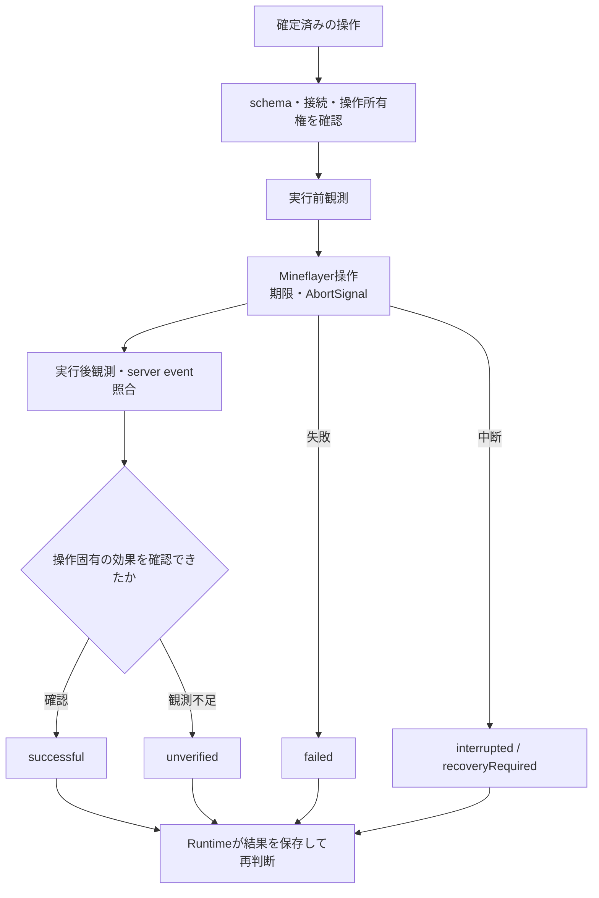

# プレイヤー操作アダプター

`MineflayerClient.createPlayerBody()` は、現在接続中の通常の Mineflayer 接続に対する安定した `PlayerBody` 窓口を返します。アダプターはプレイヤーの一般的な操作と観測を担い、呼び出し側は `AbortSignal` を渡し、状態変化・操作イベントを購読し、いつでも `stop()` を呼び出せます。`stop()` は移動入力、アイテム使用、採掘、経路探索、乗り物の入力を直ちに解除し、開いている画面を閉じます。

対応するプロトコルでは、接続準備の完了前に周囲のチャンクを読み込み、`player_loaded` 通知を送ります。再スポーン時も同じ順序で通知します。対応しない古いプロトコルでは、従来どおり最初のスポーンで接続準備を完了します。

このアダプターは、従来の Bot 専用の木材採集制限、行動許可、建築ポリシー確認を適用しません。プレイヤーが実行できることは、Minecraft の物理挙動と接続先サーバーの通常の権限によって決まります。チャットコマンドや任意コマンドの実行、管理者操作、認証情報の操作、権限迂回は公開しません。`stop` とランタイムの永続停止ラッチは維持されます。

## 呼出しから結果まで

責務は [PlayerBody](../src/minecraft/player-body.ts)、[入力schema](../src/minecraft/player-body-schema.ts)、[観測型](../src/minecraft/player-body-observation.ts)、[registry知識](../src/minecraft/player-body-knowledge.ts)、[操作判断manual](../src/minecraft/player-body-manual.ts) に分かれます。呼出し側の制御は[自律プレイヤー](autonomous-player.md)を参照してください。

この図は結果分類の概略です。各操作の例外や検証条件は下記の成功確認を参照してください。Bodyの成功は操作単体の効果を表し、owner goal全体の達成はPurposeが最新観測と合わせて判断します。

## 操作一覧

実行可能な操作名の正本は`playerOperationNames`です。31 操作はすべて`playerOperationSchema`・PlayerBody dispatch・PurposeAgent の GPT 向け操作 catalog に接続されています（実装上の接続を示し、GPT が各操作を実ゲームで選んだ証拠ではありません）。表の「ゲーム上」は通常の Java 版プレイヤー操作として可能か、「library」は依存 library に必要な API または構成要素があるかを示します。API があることだけでは、その環境での成功を保証しません。

Mineflayer は`package.json`と`package-lock.json`で`4.39.0`、`mineflayer-pathfinder`は`2.4.5`に固定されています。library 欄は実装コードと[Mineflayer 4.39.0 API](https://github.com/PrismarineJS/mineflayer/blob/4.39.0/docs/api.md)、[同版の変更履歴](https://github.com/PrismarineJS/mineflayer/blob/4.39.0/docs/history.md)を照合しました。変更履歴では4.35.0にMinecraft 1.21.11対応が追加されています。pathfinderの到達性やserverごとの結果は、別途ゲーム内で確認します。

各操作は通常のJava版の所持品・到達距離・server権限等に従います。schema/catalog/dispatchへの接続、libraryのAPI、実ゲームでの確認を分けて読みます。

| 操作群                                                                           | library / 構成要素                                                                    | 主な条件・阻害要素                                                                            |
| -------------------------------------------------------------------------------- | ------------------------------------------------------------------------------------- | --------------------------------------------------------------------------------------------- |
| 移動・視線・入力：`move_to`, `move_relative`, `look`, `look_sweep`, `control`    | `look`, `lookAt`, control 入力。経路探索は`mineflayer-pathfinder`                     | 読込済み地形、経路、通常の到達距離、時間上限                                                  |
| 装備・使用・攻撃：`equip`, `use`, `attack`                                       | `equip`, `activateItem`, `useOn`, `attack`                                            | 対象 item、通常の到達距離、server 応答。攻撃元を特定できない protocol では hit を確認できない |
| 採掘・設置・制作：`dig`, `place`, `craft`                                        | `dig`, `placeBlock`, `craft`                                                          | 対象の可視性、道具・材料・設置面・recipe・server 側更新                                       |
| 画面・設備：`open_window`, `window_click`, `window_transfer`, `window_close`     | container API、`clickWindow`, `transfer`, `closeWindow`                               | 可視・到達可能な対象、対応 window/protocol、正確な slot readback。modded 画面は未保証         |
| 所持品：`consume`, `toss`, `transfer`                                            | `consume`, `toss`, `transfer`                                                         | 所持数・空き slot・食料状態。効果を観測できない場合は未確認                                   |
| 拾得：`collect_item`                                                             | item 拾得専用操作ではなく、通常の移動・可視 entity 追跡・`playerCollect` event を使用 | 開始時から可視の対象 ID が必要。遮蔽・視界喪失・経路失敗時は停止                              |
| 釣り：`fish`                                                                     | `fish`                                                                                | 釣竿、環境、浮き・釣果 event と拾得確認                                                       |
| 睡眠・乗り物：`sleep`, `wake`, `mount`, `dismount`, `move_vehicle`, `elytra_fly` | `sleep`, `wake`, `mount`, `dismount`, `moveVehicle`, `elytraFly`                      | 有効な bed/entity/vehicle、sleep 条件、飛行装備・状態、protocol                               |
| 専門画面：`trade`, `enchant`, `anvil`, `write_book`, `update_sign`               | `trade`, enchantment table / anvil API, `writeBook`, `updateSign`                     | offer・素材・経験値・画面種類。NBT/古い protocol で内容を読めない場合は未確認                 |

### 現在の条件から操作を判断する

`describe_operation` は操作ごとの`manual`も返します。`implementation: "body_operation_provided"`はschema・catalog・Body dispatcherに操作があることを示し、現在の接続で実行できるという意味ではありません。`currentAvailability`は毎回のfresh観測と実行前提の照合を求めます。null・欠落・古い観測は「利用不可」ではなく「不明」として扱い、前提を確かめてから試してください。`unavailable`にはPlayerBodyから公開しない操作境界を示します。

`preconditions`とschemaで対象・所持品・到達性・通常権限を確認し、`successEvidence`とBodyの実行結果で効果を判定します。`historicalTrial`は過去の限定された実ゲーム試験の範囲であり、現在の接続・環境の動作保証ではありません。`unverified`は確認不足です。ownerの依頼全体が達成されたかは、操作単体の`successful`とは別に確認します。

`move_to`は現在位置と到達範囲、freshな経路・地形の条件を見て選びます。`look_sweep`は8方向の可視範囲を返しますが、候補の省略や検索上限があり、対象が返らないことは不在の証明になりません。`attack`はfresh観測に見える通常到達距離内の対象が必要です。命中は自身を攻撃元とする`entityHurt`で、対象の死亡は別の効果として確認します。

被害時の`bot_damaged`は`at`、`source`（`kind`・`name`・`category`、または`null`）、`confidence`（`observed`・`unknown`）を持ちます。`bot_death`の`cause`は任意です。死亡後1秒以内に対応する構造化通知を受けると、`bot_death_cause_updated`を一度だけ追加し、`deathAt`で元の死亡へ結び付けます。これは新たな死亡ではありません。更新されるcauseには`causeKey`、source、confidence、provenance（`damage_event`・`death_notification`）が含まれます。正規レジストリのMobならsource名はcanonicalなentity名になり、識別できない相手やplayer名の本文はgenericな`death_cause`とtranslation keyで表します。これらのeventは数値のentity ID・座標・usernameを含みません。sourceやcauseがない場合は攻撃者・死因を特定できません。vitals変化後に取り直す`self.health`も`null`になり得ます。これらは見えている手掛かりであり、完全なダメージ記録ではありません。移動・見渡し・攻撃を選んだ後も、それぞれの実行結果を別に確認します。

### 過去の代表的な実ゲーム確認（操作群別）

- **移動・視線・入力**: 初回代表：`look`・移動を#75で受入。`look_sweep`、`control`など他操作は未測定
- **装備・使用・攻撃**: 初回代表：`equip`はfresh Body headと独立server readbackで確認。`use`・`attack`は未測定
- **採掘・設置・制作**: 初回代表：#83で独立serverのoak/birch所持増加と達成後の`dig`・`collect_item`を確認。#72の`place`は別Issueの代表証拠。`craft`は未測定
- **画面・設備**: 一部：run9/10 の open・close は Body 結果と画面状態、transfer-in は Body 結果・slot 差分と RCON の炉入力内容変化を確認。transfer-out は Body の所持品/slot 差分まで（RCON による返却先所持品 readback は未確認）。他設備の群別受入は未確認
- **所持品**: 初回代表：`consume`でbread 1→0とfood増加を確認。後続のfull-food段階は未完了。`toss`は未測定。`transfer`は下記の既存確認範囲を維持
- **拾得**: 初回代表：#83の自然な採集依頼と独立readbackで確認。#72の乾地 pickup は別Issueの代表証拠として維持
- **釣り**: 未確認
- **睡眠・乗り物**: 未確認
- **専門画面**: 未確認

上の実ゲーム記録は、過去の[#75に記録された代表試験](https://github.com/stillshore-chirp/mc-bot-egent-practice-2/issues/75#issuecomment-5863730780)を31操作全体の網羅と混同しないための証拠状態です。初回範囲は`look`・移動・`dig`・`collect_item`・`equip`・`consume`と停止の代表場面です。装備readbackは[#63の公開進捗](https://github.com/stillshore-chirp/mc-bot-egent-practice-2/issues/63#issuecomment-5850402144)、採集・達成後の操作は[Issue #83](https://github.com/stillshore-chirp/mc-bot-egent-practice-2/issues/83)、consumeの代表結果は上記[#75進捗](https://github.com/stillshore-chirp/mc-bot-egent-practice-2/issues/75#issuecomment-5863730780)を参照します。既存の[#69公開receipt](https://github.com/stillshore-chirp/mc-bot-egent-practice-2/issues/69)と[#78公開receipt](https://github.com/stillshore-chirp/mc-bot-egent-practice-2/issues/78)も、それぞれの元の範囲で再利用します。ここに記す実ゲーム結果は実施時点・個別scopeの証拠であり、現在の接続状態や現在の運用成功を証明しません。記録内の「未測定」は初回代表に含まれない操作の測定状態を示し、未実装やゲーム上不可能という意味ではありません。31 操作の schema/catalog 接続は実装状態を示すもので、各操作の実ゲーム受入証拠ではありません。

### 操作固有の成功確認

- `dig`は読込済みで通常到達距離内の対象へ操作内で向き直り、視認性・遮蔽・同じ接続を再確認してから採掘します。対象がその視点から見えないままなら採掘しません。`attack`は Bot 自身を攻撃元と特定できる`entityHurt`だけで命中を確認し、命中と死亡は別の結果にします。`dig`・`place`は対象位置のサーバー起点更新を照合し、採掘後の空気または要求した設置 block を確認します。クライアント内の楽観更新だけでは成功にしません。`craft`は要求アイテム数の増加を確認します。
- window 移送は対象 item と slot ごとの正確な増減を確認します。`consume`は item 数の減少と満腹度の増加の両方を必要とします。
- `collect_item`は開始時に可視の entity ID だけを受け付け、250ms ごとに可視性と位置を再観測します。視界を失えば停止し、45 秒期限・`AbortSignal`・`stop()`に従います。成功には対象 ID に一致する`playerCollect` eventと、その event から得た item 名の所持数増加を最大 1 秒の再観測内で両方確認する必要があります。増加が不明なら`unverified`とし、entity 消失・視界喪失・不正対象・経路失敗・timeout を別の`itemCollectionOutcome`として扱います。
- `fish`は浮き・食いつきの粒子を観測し、引き上げ後の回収 item とインベントリ増加を照合します。sleep/wake・乗降・乗り物操作は要求状態や位置・status を確認し、乗り物入力 tick を制限します。
- `trade`は選択した取引の入出力 item 数、`enchant`は対象へ新しく付いた効果、`anvil`は要求名を確認します。本や看板の内容は接続 protocol が提供する範囲だけを確認します。

`use`のアイテム対象は`holdTicks`で使用入力を保持できます。範囲は 1〜200、既定値は 4 で、実装では 1tick を 50ms として待ちます。上限 200tick（10 秒）は既存の`use`操作の 15 秒タイムアウト内で待機と事後観測を終えるためです。キャンセルまたは`stop()`では保持中のアイテム使用を直ちに解除します。保持時間や API 受付だけでは成功とせず、現状は実行前後で選択した手持ちアイテムと同名のインベントリ総数が減った場合に限って`successful`とします。発射物の発生・命中や使用効果自体は確認しないため、数量変化を観測できない場合は`unverified`です。

`open_window`は操作パケット送信前ならキャンセル時に待機を破棄します。送信後は呼び出し元へキャンセル結果を返しつつ、遅れて届く画面を閉じるまで内部操作を未完了として隔離します。接続終了時は待機 listener を破棄し、再接続後の操作を受け付けます。停止中に遅着画面を閉じても、停止状態を解除する操作は行いません。

採掘の待ち時間は対象ブロックに対する現在の Mineflayer `digTime` 推定値へサーバー更新の猶予 5 秒を加えて決め、下限を 35 秒、上限を 5 分とします。対象ブロックを取得できない場合や推定値が負値・非有限値の場合は 35 秒を使います。Mineflayer の採掘 Promise がクライアント内の楽観的なブロック更新で完了した場合も、対象位置のサーバー起点ブロック更新を最大 5 秒待ってから証跡を判定します。この待機は全体の採掘 timeout 内に含まれ、停止・キャンセルで直ちに終わります。対象以外のブロック更新や 1.21.11 の sequence ID だけの ack は成功の根拠にせず、対象位置の更新が届かなければ`unverified`です。

汎用ウィンドウの状態には、現在の画面の`type`・`title`と、上限付きのスロットごとのアイテム名・数が含まれます。かまどと醸造台のスロットも観測できます。GPT は`window_click`や`window_transfer`で画面を操作し、その後の状態を再観測できます。レシピやサーバー固有画面を利用できない場合はあります。`enchant`、`anvil`、`trade`は専用操作としても提供しますが、同じ画面の汎用操作を使うためにこれらの補助操作は必要ありません。

## 観測できる範囲

`observe()` は ISO 形式の`observedAt`、自身のステータス・インベントリ・装備・時刻・画面、および可視範囲のブロックとエンティティを返します。視野は距離 16 ブロック、水平 110°、垂直 80° までで、ブロックやエンティティによる遮蔽を考慮します。ブロック候補は最大 3 回検索し、各検索で最大 192 件を調べます。画面中央の raycast が距離・視野内で最初に捉えたブロックは、候補検索から漏れても出力枠を優先します。結果はブロック名ごとに近い候補を交互に選び、最大 96 件を含めます。エンティティ候補は最大 128 件を調べ、結果には最大 64 件を含めます。検索上限で候補が残る可能性は`candidateSearchMayBeTruncated`で示し、出力上限による省略数も返します。読み込まれているだけで隠れているワールド要素は、現在見えている情報として公開しません。

可視エンティティには、Mineflayerが受信済みの装備種を`mainHand`、`offHand`、`head`、`torso`、`legs`、`feet`として含めます。slot keyの省略は未受信または取得できず不明、`null`は受信した空欄を表し、値はitem kind名だけです。`look_sweep`も各可視entityについて同じ情報を返します。

Mineflayer が値を取得できない体力、酸素、液体・炎の状態、ゲームモード、時刻は`null`で表します。所有者の座標は、呼び出し側が明示的に`observe({ ownerPositionException: true })`を指定した場合に限り返します。その場合は`source: "owner_position_exception"`と所有者が現在見えているかを併記します。

`knowledge(query)` は接続中の Minecraft レジストリに基づくバージョン付き情報を返し、レジストリ由来の事実と、クラフト可能性などの`inferences`を区別します。サーバー内部情報を一括取得する機能ではなく、mod 導入環境のレシピや画面をすべて操作できる保証でもありません。

## 完了確認とキャンセル

操作結果は実行前後の観測とともに、`successful`、`failed`、`interrupted`、`unverified`のいずれかを返します。Mineflayer のメソッドが正常終了しただけでは成功と判断しません。クラフト、村人との取引、本の編集、一部のプロトコル依存画面など、内部処理へ`AbortSignal`を渡せない操作があります。キャンセル時は操作を後始末し、実行中の処理が完了するまで最大 2 秒待ちます。処理が残っている場合は`recoveryRequired: true`を返し、`operation_recovery_required`を発行して、その処理の所有状態を保持します。処理が完了するか、旧 Bot が切断されて別 Bot に接続し直すまで次の操作を受け付けません。ランタイムは通常の再接続経路を使い、停止ラッチを維持します。

`move_to`では、経路探索が`noPath`を報告しても目的地の観測が優先して成功を確認します。`goto()`が正常終了しても到達を観測できず、最新の経路更新が`noPath`なら`failed`を返します。後続の経路更新は古い`noPath`を置き換え、中断と timeout の分類を維持します。

`collect_item`は開始時点で通常の視野内にあるitem entityだけを受け付けます。追跡中は現在観測できた位置だけへ経路を更新し、対象が遮蔽・視界外・出力上限によって観測できなくなった場合は経路を停止します。`GoalNear`は整数block nodeの半径1を使い、goal到達後も可視itemとの3D距離が2.5秒の観測猶予後に1.25 blockを超える場合は`pickup_out_of_range`で停止します。拾得は対象IDに一致する`playerCollect` eventと、そのitem名の所持数増加を最大1秒の再観測内で確認します。eventだけ届き所持数増加を確認できない場合は`unverified`とし、単なる接近やentity消失を拾得成功とは扱いません。pathfinderの`noPath`・`timeout`イベントと`goto()`拒否は、結果の`itemCollectionPathFailureReason`で固定enumに分けます。可視性を失った後のentity位置や、拒否error本文は結果に含めません。

プロトコルや NBT 形式の違いは成功確認を制限します。`attack`は攻撃元を特定できる`entityHurt`に依存します。攻撃元のない古いプロトコルの hurt イベントや、通常 Mineflayer から不明として返る Mob の体力だけでは命中を確認しません。命中後の`entityDead`は、対象が死亡した別の観測結果として返します。現在のアイテム表現が認識しない記入済みの本のページ NBT、古いプロトコルで利用できない看板の裏面、mod 導入環境の画面、サーバーによる巻き戻し、観測可能な事後状態のない効果は`unverified`になります。汎用ウィンドウ操作では実際に観測したスロット状態を返し、意味上の操作が成功したと推測して補いません。
