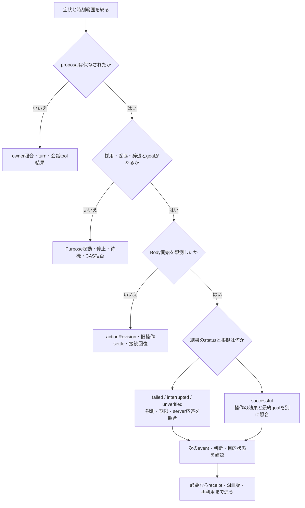

# テスト・評価と原因調査

このプロジェクトでは、test double による設計検証と、実 Minecraft・実 OpenAI API による受け入れ試験を分けます。前者の成功は後者の代替ではありません。

## 1. 評価する対象を先に分ける

| 問い                 | 根拠                                          | それだけでは言えないこと                                 |
| -------------------- | --------------------------------------------- | -------------------------------------------------------- |
| 入力を受け取ったか   | owner照合、会話turn、proposal                 | 採用・実行されたとは限らない                             |
| 判断を確定できたか   | judgment、revision、tool結果code              | Bodyが開始・成功したとは限らない                         |
| 操作が始まったか     | activeOperationの `bodyStartedAt`             | commit時刻 `startedAt` だけでは実開始の証拠にならない    |
| 操作単体が成功したか | Bodyのbefore/after、対応event、receipt        | owner goal全体の達成とは限らない                         |
| 目的を達成したか     | owner-linked goal、期待した最終状態、最新観測 | 発話やgoal更新だけで未観測の成功を補わない               |
| 学習したか           | receiptとSkill版の関連、後続の使用と結果      | 作成/改訂件数だけで汎化・能力向上は証明しない            |
| 人格・関係が伝わるか | 同じpersona/場面条件での発話と選択理由の評価  | DBにpersona/relationshipがあるだけでは自然さを保証しない |
| 費用を比較できるか   | case範囲、call/token/latency、usageUnknown    | unknownを0と扱わない。異条件のrunを改善率にしない        |

文書刷新（#121）はdotによる静的調査です。以下のテストは**既存の検証手段の説明**であり、今回新たに実行して合格した一覧ではありません。

## 2. どこを観測するか

| 観測先                         | 見えるもの                                                          | 見えない/注意するもの                                            |
| ------------------------------ | ------------------------------------------------------------------- | ---------------------------------------------------------------- |
| 構造化log                      | 分類、固定code、API round・使用量・時間、接続失敗                   | 生の会話・promptを公開用logへ足さない                            |
| `collectLiveEvidence().player` | purpose、goal/proposal、停止、直近判断/結果、観測、学習参照、集計   | 全履歴ではない。除去済みの一部位置以外にも機微な自由文が残り得る |
| `recentAgentActivity`          | role、round、tool名、resultClass/code、CAS変更箇所、入力文字数等    | モデル内部の思考全文や入力全文ではない                           |
| Skill repository               | 使用版、trusted receipt、native outcome、改訂/仮説の関連            | import統計は自分の観測実績ではない                               |
| dashboard trace                | 会話/目的thought、Responsesのdeliberation、session内の接続retry計測 | 既定経路の全tool/Body/学習がDAGでつながるわけではない            |
| 実ゲーム評価のartifact         | case条件、達成・未完了、独立したserver観測、予算                    | fixture準備失敗は製品の行動失敗ではない                          |
| private sidecar                | 人が判断する必要のある限定された発話・snapshot                      | privateな補助ファイル。Issue/PRへ転載しない                      |

実装: [application evidence](../src/app/player-application.ts)、[runtime evidence](../src/player/runtime.ts)、[round activity](../src/player/responses.ts)、[safe projection](../src/player/observation-evidence.ts)、[private sidecar](../tests/e2e/player-snapshot-sidecar.ts)。

### traceの成功をゲームの成功と混同しない

`PlayerRuntime.#traceCall()` は会話turn/目的thoughtが返った時点でtraceを閉じます。Bodyの実行は `handleCommittedDecision → #executeBody` の別のpromise系列で進みます。そのためtraceの `succeeded` は、思考処理が返ったことを示し、Body成功やgoal達成の証明ではありません。CASで判断が受理されず戻った場合も、この違いが重要です。

現状は `minecraft_action / verification` 等のschemaがあるだけで、既定PlayerRuntimeの全Body結果がそのspanとして生成されるわけではありません。必要な結果はMindStoreとSkill receiptを照合します。この計測の関連付け不足は [Issue #123](https://github.com/stillshore-chirp/mc-bot-egent-practice-2/issues/123) で別に追跡します。文書の図で未実装のtraceを存在するように補いません。

## 3. 「返事はしたが、依頼を達成しない」を辿る



1. **症状を固定する**: 何を期待し、何を実際に観測したか、どの版・場面かを分ける。まず既存の証跡を読む。
2. **入力を追う**: `proposals` がなければ [receiveChat / handleOwnerMessage](../src/player/agents.ts) とtool結果を調べる。会話の了承だけを提案保存の代わりにしない。
3. **判断を追う**: pendingのままなら、停止・wait・pendingEventKinds・直近roundを確認する。`CAS_STALE` の場合は `changedComponents` を使い、古い状態へcommitを通す修正をしない。
4. **実行を追う**: `activeOperation` はdispatch前に永続化される。実開始は `bodyStartedAt`、操作結果は `recentOutcomes` で確認する。復旧待ちなら接続状態も読む。
5. **効果を追う**: `dig` はblock更新、`collect_item` は対象一致の拾得eventと所持数増加、`consume` は所持数減少とfood増加を確かめる。個別条件は [PlayerBody](player-body.md)。
6. **次の判断を追う**: 操作成功でもgoalが残るなら、最新観測・expectedOutcome・次のdecisionを照合する。無進捗での見回し反復等は操作成功数だけで評価しない。
7. **学習を追う**: 使用Skill/版とreceipt、learning参照、保存された改訂を照合する。保存不要と評価された場合もある。

### よく使う切り分け表

| 状況                           | 最初の手掛かり                            | 調査する境界                                                                                                      |
| ------------------------------ | ----------------------------------------- | ----------------------------------------------------------------------------------------------------------------- |
| `STALE_REVISION` / `CAS_STALE` | stop/action/outcome/proposal等の変更箇所  | [MindStore.commitThought](../src/player/mind-store.ts) と [Responsesの古い結果打切り](../src/player/responses.ts) |
| `NO_ACTIVE_OPERATION`          | continue時のsnapshot                      | 行動終了後の古い判断か、モデルの選択か                                                                            |
| `PROPOSAL_NOT_PENDING`         | proposal状態とowner goalのリンク          | 提案解決済み、または位置例外の条件外か                                                                            |
| `INVALID_PLAYER_OPERATION`     | kindと返された現行schema                  | schema未参照、引数不足、型不正か                                                                                  |
| `operation_stalled` / path失敗 | Body結果、fresh観測、直近行動パターン     | 見えている通路/扉と経路条件。目的選択と身体制御を分ける                                                           |
| `BODY_RECOVERY_REQUIRED`       | cleanup状態・接続event                    | 未完了native操作の所有権を保持しているか                                                                          |
| `PLAYER_SKILL_EVIDENCE_FAILED` | receiptの有無、Skill/版/operation         | Body結果保存と学習証拠が一致しているか                                                                            |
| `GOAL_MIRROR_PERSIST_FAILED`   | MindStoreのgoalとLifeState                | 主commitと後続mirrorを混同していないか                                                                            |
| 学習更新がない                 | receipt status、版、重複、tool resultCode | 適用条件外か、保存不要か、保存失敗か                                                                              |
| tokenが少なく見える            | `usageUnknownCalls` と理由別counter       | provider未返却分を含まない下限値か                                                                                |
| 記憶が次回入力にない           | storeの種類と保持/入力上限                | 消失か、短期会話か、検索/件数制限か                                                                               |

## 4. 既存テストとの対応

| 確認したい契約                             | 代表的なテストソース                                                                                                                                                                                |
| ------------------------------------------ | --------------------------------------------------------------------------------------------------------------------------------------------------------------------------------------------------- |
| 既定applicationとlegacyの組立              | [player-application.test.ts](../tests/unit/player-application.test.ts)                                                                                                                              |
| 停止、event、CAS、再起動、Body所有権       | [player-runtime.test.ts](../tests/unit/player-runtime.test.ts)                                                                                                                                      |
| 会話の文脈、能力説明、owner intent、割込み | [player-agent-owner-intent.test.ts](../tests/unit/player-agent-owner-intent.test.ts)                                                                                                                |
| owner proposalとgoalの継続・競合           | [player-owner-goals.test.ts](../tests/unit/player-owner-goals.test.ts)                                                                                                                              |
| 操作catalogとschema                        | [player-operation-discovery.test.ts](../tests/unit/player-operation-discovery.test.ts)                                                                                                              |
| 身体操作の結果・観測境界                   | [player-body.test.ts](../tests/unit/player-body.test.ts)                                                                                                                                            |
| API round、usage、打切り                   | [player-agent-rounds.test.ts](../tests/unit/player-agent-rounds.test.ts)                                                                                                                            |
| context圧縮とcall/outputの対応             | [player-response-compaction.test.ts](../tests/unit/player-response-compaction.test.ts)                                                                                                              |
| 死亡回収の根拠条件                         | [player-death-recovery-policy.test.ts](../tests/unit/player-death-recovery-policy.test.ts)                                                                                                          |
| 技能の版・receipt・学習                    | [mc-skills.test.ts](../tests/unit/mc-skills.test.ts)、[player-learning.test.ts](../tests/integration/player-learning.test.ts)                                                                       |
| 保存・検索・再起動                         | [memory.test.ts](../tests/unit/memory.test.ts)、[memory-restart.test.ts](../tests/integration/memory-restart.test.ts)                                                                               |
| trace schema・redaction・保存              | [trace-contracts.test.ts](../tests/unit/trace-contracts.test.ts)、[trace-redaction.test.ts](../tests/unit/trace-redaction.test.ts)、[trace-store.test.ts](../tests/integration/trace-store.test.ts) |

テストファイルの存在は、今回のHEADでの合格を意味しません。実行結果を使う場合は対象commitと実行条件を添えます。旧skill/reflexのテストを、既定Purposeの実ゲーム能力の証拠として使いません。

## 5. 実ゲーム評価を読む

現行の広いAIプレイヤー評価は [ai-player-live.ts](../tests/e2e/ai-player-live.ts) と [AIプレイヤーE2E手順](ai-player-e2e.md) が入口です。隔離serverのfixture、Body操作、独立したserver側読取り、実LLMの判断を分けて記録します。

- `pass`: そのcaseの受け入れ条件をそのrunで満たした。
- `fail`: そのcaseで確認できた不一致。どの境界で失敗したかを読む。
- `incomplete`: fixture、証拠、使用量、期限等が不足。0件成功や製品失敗へ一律変換しない。
- operatorの発話評価を残すcaseでは、機械的な件数/regexの合格だけで自然文の正しさを確定しない。

既存の初回代表受入は31操作の網羅ではありません。死亡回収の成功や浅水からの自律帰岸など、未確認の範囲は [Bodyの実ゲーム記録](player-body.md#過去の実ゲーム確認操作群別) と各caseの原記録を確認します。取り止めた網羅試験を、本書の説明だけで新しい必須作業に戻しません。

## ローカル品質確認

```bash
npm run format:check
npm run lint
npm run typecheck
npm test
npm run build
npm run audit:high
```

GitHub Actions は通常PRで一つの `CI` workflowだけを起動します。最初に `scripts/classify_verification_inputs.py` が `base...head` の変更pathを分類し、必要なjobだけを実行します。最後の `Quality gate (selected checks)` は、選択されたjobの成功と未選択jobのskipを照合します。未知path、diff失敗、選択状態の不整合はfail-closedです。

| 変更範囲                                                | 選択する検証                                                             |
| ------------------------------------------------------- | ------------------------------------------------------------------------ |
| server、runtime、unit/integration test、製品docs/config | Node.js 22 / 24のtest・build、Node.js 24のformat・lint・typecheck・audit |
| dashboard、trace、browser spec/config                   | 製品検証 + Node.js 24のPlaywright browser test                           |
| agent rule、Skill、adapter、governance docs/template    | 中央governance validator、Skill検証、focused契約test                     |
| workflow、classifier、workflow契約test                  | 全job + workflow契約test                                                 |

workflowはpath filterで起動自体を消しません。削除・renameの両側を分類するため、PRでは `git diff --name-only --no-renames -z base...head` を使います。同一のHEAD・base・入力閉包・実行条件で成功した証跡は再利用し、交差する入力が変わったgateだけを再実行します。

`audit:high`はhigh / critical advisoryを品質gateにし、moderate認証依存の過去の調査は [Issue #4](https://github.com/stillshore-chirp/mc-bot-egent-practice-2/issues/4)、今回のhigh解消と残存項目は [Issue #124](https://github.com/stillshore-chirp/mc-bot-egent-practice-2/issues/124) を参照します。現在の件数は対象lockfileへの監査結果で判断します。CI は API key、Minecraft 接続情報、実 world を持たず、live E2E を起動しません。

## Unit test

Unit test は外部境界を fake に置換してよい範囲です。製品 build に test-only 実装を混入させません。

- environment schema と上限値、credential 不足時の fail-fast
- task status、優先順位、cancel、retry、timeout、checkpoint
- tool input validation、統一 failure detail、壊れた LLM tool input の拒否
- snapshot 比較、inventory 数量、success / failure 判定
- persona context の生成
- memory の保存、検索、訂正、撤回、重複、矛盾、commitment完了根拠
- hostile退避の走行線分、runtime再評価の直列化、drop選別と採掘再試行

## Integration test

Integration test は実装された依存境界の契約を確認します。Minecraft server や OpenAI API の実アカウントは使いません。

- Mineflayer adapter と runtime の event / snapshot 契約
- tool から skill への schema 済み引数の伝達
- SQLite migration、transaction、再起動復元
- OpenAI Responses API の function-call output に対する validation
- Minecraft 観測イベントから reflexes への伝達
- Bot自身の酸素・水中状態・観測時刻と危険判定の一致、利用者体調の未観測契約
- 長時間 skill の cancellation と再開判断

## 実環境 E2E

以下は初期12項目の対話式runnerの手順です。現在の `tests/e2e/live.ts` は `createApplication()` を呼ぶため既定Player経路で起動しますが、12項目の受入項目と2026-08-25の記録は旧実装に由来します。現行Player全体の受け入れには上のAIプレイヤー評価を参照し、旧task/reflexの出力説明をそのまま適用しないでください。

Minecraft 26.1系のMacクライアントと本Botを同一サーバーへ接続する検証は、[専用手順](minecraft-26-1.md)を使います。この手順は接続・日本語会話・即時停止・切断の受け入れに絞り、以下の12項目runnerの全件成功とは区別します。

`npm run test:e2e` は実 Minecraft Java Edition server と実 OpenAI API を対象にします。次の preflight が一つでも欠ける場合、Minecraft 接続や API 呼出しを開始せず、設定エラーとして失敗させます。

このcommandは対話式です。安全なtest world、botの接続、block破壊、危険・空腹の再現、process再起動、切断試験まで許可されたrunでだけ、`.env.local`の`LIVE_E2E_CONFIRMED`を`true`にします。既定値`false`では製品runtime moduleの読込み、外部接続、API呼出しより前に停止し、非対話CIでも実行しません。各項目はoperatorが実worldの画面と観測状態を確認して`pass`、`fail`、`skip`を記録し、全項目`pass`の場合だけ終了code 0になります。

1. `.env.local` に `MINECRAFT_HOST`、`MINECRAFT_USERNAME`、`OWNER_USERNAME`、`OPENAI_API_KEY` が設定され、port、auth、version、各上限値が validation を通る。
2. 対象 server と world、bot account、指定利用者、行動範囲、切断・再起動試験の許可が確認されている。
3. Mineflayer が対象 Minecraft version を直接サポートし、OpenAI model と Responses API の利用権限・ネットワーク到達性が確認されている。
4. 実験用の安全な場所に、食料、検出可能な危険、原木、帰還できる利用者が用意されている。実利用中の world や他者の資産に影響する試験は行わない。

preflight を通過したら、以下を同一の E2E run または追跡可能な一連の run で確認します。

1. bot が独立した player として接続する。
2. 指定利用者の日本語チャットを認識し、日本語で応答する。
3. 指定利用者を安全な距離で追従する。
4. 停止指示により移動または長時間作業が即時中断する。
5. 空腹時に食事する。
6. 指定利用者から明示された情報を記憶する。
7. process 再起動後にその記憶を復元する。
8. 指定種類・指定数の原木を収集する。
9. 依頼者の位置へ帰還する。
10. inventory の観測値に基づき完了数を報告する。
11. 資源不足、経路不達、timeout、cancel などの途中 failure を確認済み状態とともに正しく報告する。
12. 接続を失った後、設定された上限で復帰するか、明示的な停止状態へ遷移する。

各項目の成功は、LLM の出力、chat acknowledgement、command 受付だけで判断しません。Minecraft で観測した位置、health、food、inventory、task state、接続状態と、安全に要約した log / correlation ID を根拠にします。

runnerは項目7の前にapplicationをshutdownして同じSQLiteから再生成し、Minecraftへ再接続します。各入力後に、次の秘密を含まないmachine-readable JSON evidenceを取得します。

- 捕捉時刻とconnection managerの状態
- `connected / spawned`、health、food、oxygen、inventory総数
- 直近taskのkind、status、phase、failure code、correlation ID
- 原木収集taskの場合はresource名、依頼数、実収集数、最終所持数、依頼者との距離
- reflex state

このJSONはoperatorの画面確認を置き換えません。world座標、server address、player名、会話、memory本文、credentialを出力せず、各`pass / fail / skip`と実観測状態を同じ項目へ結び付ける監査補助です。

## E2E 証跡

Issue・PR・commit には API key、server address、IP、Minecraft username / UUID、world seed、座標、会話全文、memory 実内容、実ログ原文を載せません。次だけを一般化して記録します。

- 実行環境の区分と時間範囲
- 実行した受け入れ項目
- 観測した Pass / Fail と failure category
- 再試行の有無、停止・復帰の結果
- 未実行項目と理由

runnerのJSONを保存する場合は、repository外またはgit ignore済みの`logs/`へ置きます。Issue / PRには原文を貼らず、上記項目を一般化した要約だけを載せます。

実環境資格情報または許可がない場合は、`npm run test:e2e` を実行しません。未実施であることと残る risk を記録し、固定応答・模擬 Minecraft・模擬 LLM で E2E を代替しません。

## 2026-08-25 実施結果

この節は旧tool/runtime実装の先行HEADにおける歴史的な測定記録です。現行既定Playerや今回の文書差分の動作検証ではありません。

許可済みのローカルLAN test world、Minecraft Java Edition 1.21.11、実OpenAI Responses APIを使い、上記12項目を追跡可能な一連のrunで確認しました。最終対話式runnerは12件pass、0件fail、0件skipで終了code 0でした。

| 対象                         | 公開可能な観測結果                                                                                                       |
| ---------------------------- | ------------------------------------------------------------------------------------------------------------------------ |
| 接続・日本語会話・追従・停止 | 独立player接続、日本語応答、安全距離の追従、実行中followの`cancelled`遷移を確認                                          |
| 生存行動                     | hungerとinventoryの実観測から安全な食料の消費を確認。hostile退避の実失敗を起点に走行線分評価を修正し、回帰testを追加     |
| 記憶・再起動                 | 明示情報の構造化保存、application再生成と再接続後の復元を確認                                                            |
| 原木収集・帰還・報告         | 一つの依頼で指定1個、inventory差分1個、最終所持1個、依頼者から約3blockへの帰還を観測                                     |
| failure                      | resource / inventory、path、短時間上限によるtimeout、即時cancelを実runで発生させ、成功扱いせず日本語で報告することを確認 |
| 切断                         | server切断後、設定した再接続上限で`connectionState=failed`と明示的なretry exhausted状態を確認                            |

接続先、player名、座標、会話、記憶本文、相関ID、実log原文、runner JSON、SQLite実dataはrepositoryへ保存していません。確認範囲は単一のローカル環境であり、remote / managed server、異なるworld条件、認証構成の網羅、複数hostile配置での修正後退避、長時間連続soak、他OSは未確認です。当時のmoderate dependency advisoryの調査記録は [Issue #4](https://github.com/stillshore-chirp/mc-bot-egent-practice-2/issues/4) にあります。
